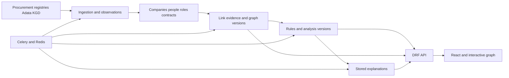

# GovernmentProcurementGraph architecture

Recorded on 5 October 2026 after Phase 2. This document distinguishes implemented behaviour from the target thesis architecture. Ingestion, provenance, and identity are implemented; KGD, snapshots, DRF, and React remain planned.

Collect procurement/company information, show verifiable links, and explain observed patterns. A link does not establish wrongdoing; group contract volume is not damage. Conclusions require sources, temporal context, and confidence.

Related: [audit](AUDIT.md), [baseline](BASELINE.md), [recovery](RECOVERY.md), [roadmap](ROADMAP.md), [repository rules](../AGENTS.md).

A procurement analyst checking company links is the initial design assumption. Audience, thesis deadline, and API/AI budgets are unconfirmed and may change priorities. All project deliverables use English; Russian website localisation follows completion of the English interface. Original source labels/data retain their source language.

## Requirements status

| Requirement | Status |
| --- | --- |
| Consolidate/optimise parsers | Implemented in Phase 2: shared session, pacing, caches, checkpoints, lease, resumable stages |
| KGD information | Requested; verify service coverage/access in Phase 3 |
| DRF backend and React | Requested; gradual transition retaining Django/migrations |
| Persist graph/analysis/explanations | Requested; proposed storage below |
| Update explanations after significant changes | Phase 1 preserves texts/checks fingerprint staleness; background versioning planned |
| Substantial graph improvement | Explicitly requested; Phase 4 |
| Attractive, usable reference-based UI | Requested; user references pending, final style undecided |
| Docker backend/Celery/Redis/database | Fixed and verified in Phase 1: shared build, migration gate, health checks |
| README/startup documentation | Updated as phases progress |
| Specific LLM/budget/public startup | Unapproved; decide after measuring need/cost |

## Existing system

Django/PostgreSQL store suppliers, contracts, owners, directors, and clusters. Pages use templates/JavaScript/Bootstrap; D3 draws graphs. DRF/React are absent.

Three [parsers](../apps/ingestion/parsers) handle contracts, participants, and Adata. The shared [service](../apps/ingestion/services.py) stores observations/roles/stage progress; commands and [Celery](../apps/core/tasks.py) call it directly. [Compose](../docker-compose.yml) defines PostgreSQL, Redis, migrate, web, worker, and beat. Automatic collection defaults off. See [PHASE1.md](PHASE1.md)/[PHASE2.md](PHASE2.md).

| Area | Implementation | Limitation |
| --- | --- | --- |
| Companies/contracts | [Supplier](../apps/companies/models.py) supplier/customer roles; [Contract](../apps/contracts/models.py) customer FK; SourceObservation/SelectedFact | Supplier name retained for compatibility; source completeness/freshness unproven |
| People/roles | [PersonIdentity, Owner, Director, Ownership, Directorship](../apps/owners/models.py), source identities/candidates | Evidence and observed history exist; confirmed IIN/legal periods/ownership require external sources |
| Graph | [Connection/RiskCluster](../apps/graph/models.py), [service](../apps/graph/services.py) | UUID/text retained; Connection/immutable snapshots not a shared evidence source yet |
| Explanations | [Deterministic explainer](../apps/ai/explainer.py), saved text | GET reads/checks member fingerprint; versioned analysis/generation absent |
| LLM | Separate ai integration | Outside normal cluster viewing; no deduplication/version mechanism |
| Background work | Celery, beat, IngestionRun, fenced lease | Resumable shared pipeline; lease protects service calls, not arbitrary scripts |
| UI | Templates/Bootstrap/D3 | Graph data/layout/explanation do not form a persisted version |

The [audit](AUDIT.md) records defects/check boundaries. Architecture documentation does not verify source quality/completeness.

## Target design

A modular Django/DRF backend, React frontend, PostgreSQL, Celery, and Redis. The thesis uses one backend divided by domain. Graph databases/microservices require a measured reason and are not planned now.

PostgreSQL holds durable results/job state; Redis provides queues/cache. Cache loss must not remove graph/explanation versions. Deduplication needs database constraints/current-version checks as well as temporary locks.

| Module | Responsibility |
| --- | --- |
| `apps.ingestion` | Source adapters, transport, normalisation, observations, runs, checkpoints |
| `apps.companies` | Companies, verified identifiers, supplier/customer roles |
| `apps.owners` or future people module | Identity matching, temporal directorship/ownership |
| `apps.contracts` | Contracts/changes; lots/bidders only with available sources |
| `apps.graph` | Link evidence, stable groups, snapshots, membership history |
| `apps.ai` | Rules/findings/template and LLM explanations |
| `apps.core` | Shared technical mechanisms without hidden business orchestration |
| `frontend` | React/API requests/pages/graph interaction |

Future people-module naming/serializer placement will be decided during implementation. Table migration must preserve original-record links.

## Ingestion and provenance

Parsers in `apps/ingestion/parsers/` neither invoke later stages nor persist models. Transport handles timeouts/retries/pacing/connection reuse. Ingestion validates, saves observations, and selects fields. Actual priorities/modes/missing-field policy are in [PHASE2.md](PHASE2.md).

Distinguish success, object absence, source unavailability, malformed response, and not checked. Never reduce these to empty values or zero debt.

| Entity | Stored information |
| --- | --- |
| `IngestionRun` | Source/mode/stages/times/status/counters/diagnostics |
| `SourceCheckpoint` | Confirmed source/stream progress |
| `SourceObservation` | Subject/field/raw and normalised values/source/dates/parser version |
| `IdentityCandidate` | Possible match, evidence, confidence, decision |
| `SelectedFact`, `IngestionIssue`, `IngestionLease` | Selected provenance, retryable errors, concurrent publication fencing |
| `PersonIdentity`, `PersonSourceIdentity` | Verified or isolated identity, source, observed name |
| Tax observation (Phase 3 proposal) | Company/person, KGD information type, value, effective date, check state |

Initial loading, regular updates, and retries are separate. Checkpoints advance after confirmed processing, retaining partial-page state. Repeats produce the same domain data without duplicates.

Verified BIN is an exact company key. Name similarity finds candidates/variants. Names alone cannot merge people without reliable identifiers/supporting evidence. Legacy false merges must be reversible without losing observations.

Keep retrieval dates separate from effective periods. Unknown periods stay unknown. Simultaneous leadership requires proven overlap. Company tax debt is not owner debt.

## Evidence and analysis

`EvidenceEdge` links observations with type, participants, normalised feature, interval, sources, and confidence. Graph and explanation use the same evidence.

Feature indexes replace all-pairs comparison. Common contacts/addresses require separate treatment, possibly dedicated feature nodes/aggregates; choose after performance/usability tests.

Separate identity, link reliability, and behavioural risk. Connected-component membership proves neither every pair's direct relation nor uniform risk. Version group rules/scoring.

A rule returns a finding with code/version, participants, evidence, period, confidence, score contribution, and interpretation limits. A business centre/service provider may explain shared contacts. Calibrate risk on labelled cases rather than automatically inheriting current thresholds.

Coordinated-bidding patterns need bidders, bids, lots, and results. Contracts alone cannot establish coordinated bids or winner rotation.

## Persisting graph and explanations

Separate persistent groups, versions, and personal views.

| Entity | Purpose |
| --- | --- |
| `Cluster` | Permanent UUID/current published version |
| `ClusterSnapshot` | Immutable membership, significant nodes, link evidence |
| `ClusterLineage` | Merge/split transitions |
| `AnalysisSnapshot` | Inputs/findings/score/rule versions |
| `Explanation` | Text/status/language/model/template or prompt version/analysis link |
| `GraphViewState` | User/state-schema version/coordinates/pins/zoom/filters |

`graph_hash` covers canonical significant nodes/edges. `analysis_hash` also covers rule-used facts/metrics and relevant rule/normaliser versions. Repeat retrieval dates, row order, and run IDs do not change hashes alone. If a rule uses fact age, include an explicit analysis date/evaluation period.

Reuse text by `analysis_hash`, prompt/template version, model, and language. Changed facts/rules/explanation parameters create new results. Database uniqueness handles concurrent deduplication. Initially prepare English; add Russian variants with later localisation.

Recompute affected components/necessary neighbours and retain old snapshots. Proposed merge policy continues a deterministically chosen UUID with predecessor links; splits continue one old UUID and assign new ones to others. Selection rules require approval/tests in Phase 4. Old links resolve through lineage.

Jobs target exact snapshots. Late output stays in history without replacing current text. Show version, calculation time, and explanation state. GET reads saved results; authorised POST starts work.

Viewing state does not affect analytical hashes. Preserve existing coordinates where possible; place added nodes near neighbours and provide explicit reset.

## AI role

Deterministic rules establish matches/patterns. Templates provide the first explanation and LLM fallback.

LLM receives structured findings/allowed evidence and writes English text. It cannot invent edges or decide person identity. Validate references, numbers, evidence, and format. Source content is data, not generation instructions.

Choose provider/model/allowed disclosures/monthly budget before integration. Save results/errors; analysis remains useful without the model.

## API and interface

`/api/v1/` exposes companies/contracts/people/clusters/snapshots/evidence/explanations/job states without HTML fragments. Require validated filters/pagination/write permissions/OpenAPI.

Initially propose same-origin React/API with Django sessions and CSRF on writes. Confirm with access scenarios; revisit for separate public/mobile clients. Only permitted roles launch collection/costly generation.

React uses TypeScript. Prototype graph libraries for layout quality, density, interaction, coordinates, maintenance. React does not force Bootstrap removal; choose UI components from future references.

Phase 4 improves graph readability, highlighting, search, filters, zoom, legend, evidence, and layout restoration. Final colours/typography/components/page composition follow user references. Substantial graph improvement must not wait for final polishing. Russian website localisation follows the complete English interface.

## Deployment

Compose runs PostgreSQL/Redis/migrate/web/worker/beat with verified ordering. Integrate React into builds or add a service when ready; decide publication in that phase.

Install from lockfile; app services wait for successful migration, not independent concurrent migrations. Keep secrets outside images/repository. Persist data in volumes; verify backups separately. The user performs Git operations.

## Key decisions

| Decision | Status/reason |
| --- | --- |
| Modular Django/PostgreSQL | Implemented; Phase 2 separated ingestion |
| DRF/React | User requirement; roadmap proposes implementation |
| No name-only person merge | Implemented: scoped identities/candidates/IIN evidence/legacy isolation |
| Observations/temporal roles | Implemented; unknown legal boundaries remain unknown |
| Tax data linked to verified subject | Proposed; prevents debt transfer to people |
| Shared evidence graph | Proposed; prevents divergent computations |
| Stable UUID/snapshots/lineage | Required; inheritance refined in Phase 4 |
| Analysis hashes separate from views | Proposed; moving nodes must not regenerate text |
| Versioned background results | Proposed; prevents late-result overwrites |
| Rules/templates before LLM | Proposed; verifiable offline explanations |
| Same-origin sessions initially | Proposed; confirm roles/publication model |
| English first, Russian localisation later | User instruction; preserve original source data |

## Thesis version and further development

Proposed minimum: reproducible limited-sample collection, observations, available KGD service, evidence, graph/analysis versions, explanations, DRF/React/Compose. KGD depends on actual access; fixture demonstrations must not appear to be current checks.

1. Find a company by BIN and inspect sources/contracts.
2. Inspect each selected cluster edge through observations.
3. Repeat unchanged collection and show retained versions/no new LLM calls.
4. Add a linked company; show new version, retained history/layout.
5. Demonstrate namesakes/non-overlapping roles without false identity/simultaneity.
6. Make a source unavailable; show correct check state, resume, preserved data.

Use permitted/anonymised examples with manual labels. Measure matching precision/recall, false links by type, temporal correctness, supported explanation claims, SQL/runtime on fixed inputs, repeat LLM counts/cost. Set targets after baseline; unknown values are not achieved results.

A pilot additionally needs roles/action audit, personal-data policy, monitoring/recovery/limits/source-use review. A public startup, pricing, and specific customer scenarios are not approved scope.
