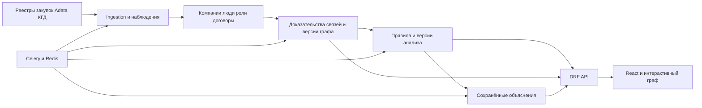

# Архитектура GovernmentProcurementGraph

Дата фиксации: 5 октября 2026 года, состояние после фазы 2. Документ разделяет реализованную систему и целевую архитектуру дипломной версии. Ingestion, происхождение фактов и модель идентичности реализованы; КГД, snapshots, DRF и React остаются планом.

Проект должен собирать сведения о закупках и компаниях, показывать доказуемые связи между ними и объяснять выявленные паттерны. Наличие связи само по себе не устанавливает нарушение, а объём договоров группы не является оценкой ущерба. Для каждого вывода нужны источники, временной контекст и степень уверенности.

Связанные документы: [аудит](AUDIT.md), [исходное состояние](BASELINE.md), [резервное копирование и восстановление](RECOVERY.md), [план фаз](ROADMAP.md), [правила работы в репозитории](../AGENTS.md).

Рабочее предположение для проектирования первой версии — пользователь, анализирующий закупки и проверяющий связи компаний. Основная аудитория, срок диплома и допустимый бюджет внешних API и ИИ пока не подтверждены. Эти вопросы могут изменить приоритеты интерфейса и объём первой версии.

## Состояние требований

| Требование | Статус |
| --- | --- |
| Объединить сбор данных и оптимизировать парсеры | Выполнено в фазе 2: общая сессия, pacing, кэши, checkpoints, lease и продолжение стадий |
| Добавить сведения КГД | Запрошено; состав доступных сервисов и получение доступа требуется проверить в фазе 3 |
| Перевести backend на DRF и добавить React | Запрошено; переход планируется постепенно с сохранением Django и миграций |
| Сохранять граф, версии анализа и объяснения | Запрошено; модель хранения предложена в этом документе |
| Обновлять объяснение при значимом изменении группы | Фаза 1 сохраняет текст и проверяет устаревание fingerprint; фоновые версии объяснения запланированы |
| Существенно улучшить внешний вид и взаимодействие графа | Запрошено дополнительно; включено в фазу 4 |
| Разработать красивый и удобный интерфейс по референсам | Запрошено; пользователь предоставит референсы позднее, окончательный стиль пока не выбран |
| Запускать backend, Celery, Redis и БД через Docker | Исправлено и проверено в фазе 1: единый build, migrations gate и healthchecks |
| Обновить README и инструкции запуска | Запрошено; документация развивается вместе с каждой фазой |
| Конкретный LLM провайдер, бюджет и публичный запуск стартапа | Не согласовано; решения принимаются после измерения потребности и стоимости |

## Существующая система

Backend построен на Django. PostgreSQL хранит поставщиков, договоры, владельцев, руководителей и кластеры. Страницы используют Django templates и JavaScript; граф рисуется через D3. DRF и React в текущей структуре отсутствуют.

Три парсера находятся в [apps/ingestion/parsers](../apps/ingestion/parsers): реестр договоров, реестр участников и Adata. Общий [сервис](../apps/ingestion/services.py) сохраняет наблюдения, роли и прогресс стадий; management-команды и [Celery](../apps/core/tasks.py) вызывают его напрямую. [Compose](../docker-compose.yml) объявляет PostgreSQL, Redis, отдельные миграции, web, worker и beat. Автосбор выключен по умолчанию. Проверенные изменения находятся в [PHASE1.md](PHASE1.md) и [PHASE2.md](PHASE2.md).

| Область | Текущая реализация | Ограничение |
| --- | --- | --- |
| Компании и закупки | [Supplier](../apps/companies/models.py) с ролями supplier/customer, [Contract](../apps/contracts/models.py) с FK заказчика, SourceObservation/SelectedFact | Имя Supplier сохранено для совместимости; полнота и актуальность внешних сведений не доказаны |
| Люди и роли | [PersonIdentity, Owner, Director, Ownership, Directorship](../apps/owners/models.py), SourceIdentity и IdentityCandidate | Роли имеют доказательства и наблюдаемую историю; подтверждённые ИИН/юридические периоды/владельцы требуют внешнего источника |
| Граф | [Connection, RiskCluster](../apps/graph/models.py), [graph service](../apps/graph/services.py) | UUID и тексты сохраняются; Connection и immutable snapshots ещё не используются как единый источник связей |
| Объяснение | [Детерминированный explainer](../apps/ai/explainer.py) и сохранённый текст | GET читает текст и проверяет fingerprint участников; версионируемый анализ/генерация ещё не реализованы |
| LLM | Отдельная интеграция в приложении ai | В основной путь показа кластера не подключена; механизм версий и дедупликации отсутствует |
| Фоновые работы | Celery, django-celery-beat, IngestionRun и fenced lease | Общий процесс возобновляется; lease действует для вызовов сервиса, а не произвольных скриптов |
| Интерфейс | Templates, Bootstrap и D3 | Граф нуждается в переработке; его данные, раскладка и объяснение не образуют сохраняемую версию |

Наблюдаемые дефекты и границы проведённых проверок перечислены в [аудите](AUDIT.md). Документ архитектуры не подтверждает качество или полноту данных внешних источников.

## Целевая схема

Предлагается модульный Django backend с DRF, отдельный React frontend, PostgreSQL, Celery и Redis. На дипломном этапе это один backend, разделённый по предметным областям. Введение отдельной графовой БД или микросервисов требует измеримого основания и пока не планируется.

PostgreSQL хранит долговременные результаты и состояние задач. Redis используется для очередей и вспомогательного кэша; потеря кэша не должна удалять версии графа или объяснения. Для исключения повторных работ нужны ограничения БД и проверка текущей версии, а не только временная блокировка в Redis.

Предлагаемые границы модулей:

| Модуль | Ответственность |
| --- | --- |
| `apps.ingestion` | Адаптеры источников, транспорт, нормализация, наблюдения, запуски и checkpoints |
| `apps.companies` | Компании и их проверенные идентификаторы; роли поставщика и заказчика |
| `apps.owners` или будущий модуль людей | Люди, сопоставление идентичности, директорство и владение во времени |
| `apps.contracts` | Договоры и их изменения; расширение до лотов и участников только при наличии источника |
| `apps.graph` | Доказательства связей, постоянные группы, snapshots и история состава |
| `apps.ai` | Правила, результаты анализа, шаблонные и LLM объяснения |
| `apps.core` | Общие технические механизмы; без скрытого управления всем бизнес-процессом |
| `frontend` | React, запросы к API, страницы и взаимодействие с графом |

Названия будущего модуля людей и расположение API serializers уточняются при реализации. Миграция существующих таблиц должна сохранять связь с первоначальными записями.

## Сбор данных и происхождение фактов

Парсеры размещены в `apps/ingestion/parsers/`. Они не вызывают следующие стадии и не сохраняют модели напрямую. Общий транспорт обеспечивает timeout, повторные попытки, ограничение частоты и повторное использование соединений. Сервис ingestion выполняет дополнительную проверку, сохраняет наблюдения и выбирает итоговые значения. Фактические source priority, режимы, политика отсутствующих полей и ограничения описаны в [PHASE2.md](PHASE2.md).

Результат запроса различает успешное наблюдение, отсутствие объекта, недоступность источника, ошибку формата и отсутствие проверки. Эти состояния нельзя сводить к пустому значению или нулевой задолженности.

Сущности ingestion (налоговое наблюдение остаётся предложением фазы 3):

| Сущность | Что сохраняет |
| --- | --- |
| `IngestionRun` | Источник, режим, стадии, начало и завершение, статус, счётчики и диагностические сведения |
| `SourceCheckpoint` | Подтверждённый прогресс конкретного источника и потока данных |
| `SourceObservation` | Субъект, поле или факт, исходное и нормализованное значение, источник, даты и версия парсера |
| `IdentityCandidate` | Возможное совпадение сущностей, основания, уверенность и решение о сопоставлении |
| `SelectedFact`, `IngestionIssue`, `IngestionLease` | Происхождение итогового поля, повторяемая ошибка и защита публикации от конкурирующего процесса |
| `PersonIdentity`, `PersonSourceIdentity` | Точная подтверждённая либо изолированная личность; источник и наблюдавшееся имя |
| Налоговое наблюдение | Компания или человек, вид сведений КГД, значение, дата актуальности и состояние проверки |

Первоначальная загрузка, регулярное обновление и повторная обработка ошибок выполняются отдельно. Checkpoint продвигается после подтверждённой обработки; частично обработанная страница сохраняет достаточное состояние для продолжения. Повторный запуск должен приводить к тем же предметным данным, а не к дубликатам.

Компания с подтверждённым БИН имеет точный ключ идентичности. Сходство названий помогает находить кандидатов и варианты написания. Для людей ФИО недостаточно: без надёжного идентификатора и подтверждающих фактов записи не объединяются автоматически. Ошибку прежнего объединения нужно уметь исправить без потери наблюдений.

У факта отдельно хранятся дата получения и период действия. Неизвестный период отмечается как неизвестный. Фраза об одновременном руководстве допустима только при доказанном пересечении периодов. Налоговые сведения компании относятся к компании; долг компании не записывается как долг её владельца.

## Доказательства и анализ

`EvidenceEdge` представляет связь с конкретными наблюдениями: тип, участники, нормализованный признак, временной интервал, источники и уверенность. Основной граф и объяснение используют один набор доказательств.

Индекс признаков заменяет полный перебор всех пар компаний. Частые адреса и контакты учитываются отдельно: массовый признак может быть слабым основанием связи и отображаться как самостоятельный узел либо агрегат. Конкретное представление выбирается после проверки производительности и удобства.

Нужно разделить идентичность, достоверность связи и риск поведения. Принадлежность одной связной компоненте не означает прямой связи каждой пары и не означает одинакового риска всех участников. Правила формирования аналитической группы и её скоринга версионируются.

Правило возвращает структурированный finding: код и версию правила, участников, доказательства, период, уверенность, вклад в скор и ограничение интерпретации. Общий бизнес-центр или контакт обслуживающей организации рассматривается как возможное объяснение совпадения. Шкала риска калибруется на проверочных примерах; текущие пороги не переносятся автоматически.

Для паттернов поведения в торгах нужны заявки, участники, лоты и результаты. Пока таких данных нет, система не заявляет обнаружение согласованных заявок или ротации победителей только по договорам.

## Сохранение графа и объяснений

Предлагается разделить постоянную группу, её версии и персональное состояние просмотра.

| Сущность | Назначение |
| --- | --- |
| `Cluster` | Постоянный UUID и указатель на актуальную опубликованную версию |
| `ClusterSnapshot` | Неизменяемый состав, значимые узлы и доказательства связей |
| `ClusterLineage` | Переходы между группами при слиянии и разделении |
| `AnalysisSnapshot` | Входы анализа, findings, скор и версии правил |
| `Explanation` | Текст, статус, язык, модель, версия шаблона или промпта и ссылка на анализ |
| `GraphViewState` | Пользователь, версия схемы состояния, координаты, закрепления, масштаб и фильтры |

`graph_hash` вычисляется из канонического представления значимых узлов и связей. `analysis_hash` дополнительно учитывает факты и показатели, используемые правилами, а также версии правил и нормализаторов, влияющих на результат. Повторное получение того же факта не меняет эти хеши только из-за новой даты скачивания. Порядок строк и технические ID запуска также исключаются. Если правило использует возраст факта, явная дата анализа или период оценки входят в его значимые входы.

Текст повторно используется по `analysis_hash`, версии промпта или шаблона, модели и языку. Изменение значимых фактов, правил либо параметров объяснения создаёт новый результат. Ограничение уникальности обеспечивает дедупликацию даже при одновременных запросах.

При изменении компании пересчитываются затронутая компонента и необходимые соседи. Старые snapshots сохраняются. Для слияния предлагается сохранять UUID выбранной продолжающейся группы и ссылку на предшественников; для разделения — оставлять UUID у одной продолжающейся группы, создавая новые UUID другим. Правила выбора продолжающейся группы должны быть детерминированы и протестированы; они пока не утверждены. Старые ссылки разрешаются через историю переходов, а не исчезают.

Фоновая задача привязана к точному snapshot. Поздний ответ для старого анализа сохраняется в истории, но не заменяет актуальное объяснение. Пользователь видит, какая версия открыта, когда она рассчитана и готово ли объяснение. GET читает сохранённые результаты. Разрешённый POST запускает новую работу.

Состояние просмотра не влияет на аналитические хеши. При добавлении компании сохранённые координаты существующих узлов по возможности переносятся, новый узел получает начальное положение рядом со связанными узлами. Предусматривается явная команда сброса раскладки.

## Роль ИИ

Детерминированные правила устанавливают проверяемые совпадения и паттерны. Шаблонный текст служит первым работающим объяснением и резервом при недоступности LLM.

LLM получает структурированные findings и разрешённые доказательства, затем составляет связный текст. Он не создаёт новые рёбра и не принимает окончательное решение об идентичности человека. Ответ проверяется: ссылки существуют, числа соответствуют анализу, утверждения имеют основания, формат соблюдён. Содержимое источников передаётся как данные и не может менять инструкции генерации.

Провайдер, модель, допустимый объём передаваемых сведений и месячный лимит расходов выбираются перед подключением. Результаты и ошибки генерации сохраняются. Анализ должен оставаться полезным при недоступности внешней модели.

## API и интерфейс

API `/api/v1/` предоставляет компании, договоры, людей, кластеры, snapshots, доказательства, объяснения и состояния фоновых работ. В ответах передаются данные без HTML-фрагментов. Нужны проверяемые фильтры, пагинация, права на изменение и OpenAPI.

Для первого варианта предлагается единый origin для React и API, Django session authentication и CSRF для изменяющих запросов. Это решение требуется подтвердить при реализации сценариев доступа. При отдельном публичном API или мобильном клиенте способ аутентификации пересматривается. Запуск сбора и дорогостоящей генерации доступен только разрешённым ролям.

React предполагается реализовать на TypeScript. Конкретная библиотека визуализации графа выбирается по прототипу: качество раскладки, плотные графы, взаимодействие, сохранение координат и стоимость сопровождения. React не требует обязательного удаления Bootstrap; UI библиотека выбирается по будущим референсам.

В фазе 4 улучшается сам граф: читаемость узлов и рёбер, выделение выбранных объектов и соседей, поиск, фильтрация, масштабирование, легенда, панель доказательств и восстановление раскладки. Окончательные цвета, типографика, компоненты и композиция страниц проектируются вместе с пользователем по референсам; обязательство переработать граф не откладывается до финальной полировки сайта.

## Развёртывание

Compose должен запускать PostgreSQL, Redis, миграции, web, Celery worker и beat с проверенной последовательностью готовности. React включается в процесс сборки или добавляется отдельным сервисом, когда готов frontend. Схема публикации frontend определяется в соответствующей фазе.

Зависимости устанавливаются из lockfile. Прикладные сервисы стартуют после успешных миграций; миграции не запускаются одновременно из каждого контейнера. Секреты не входят в образ и репозиторий. Долговременные данные находятся в persistent volumes; резервная копия проверяется восстановлением в отдельную БД. Пользователь выполняет Git операции самостоятельно.

## Ключевые архитектурные решения

| Решение | Статус и основание |
| --- | --- |
| PostgreSQL и модульный Django backend | Реализовано; исходная основа сохранена, ingestion выделен в фазе 2 |
| DRF и React | Требование пользователя; детали внедрения предлагаются в плане фаз |
| Не объединять людей только по ФИО | Реализовано в фазе 2: отдельные личности, кандидаты и доказательства ИИН; legacy роли изолированы |
| Сохранять наблюдения и временные роли | Реализовано в фазе 2; неизвестные юридические границы сохраняются как неизвестные |
| Налоговые сведения привязывать к проверенному субъекту | Предложено; предотвращает перенос долга компании на человека |
| Один граф доказательств для анализа и интерфейса | Предложено; устраняет независимые расходящиеся вычисления |
| Стабильные UUID, snapshots и история слияний | Требование сохранения состояния; детали наследования UUID уточняются в фазе 4 |
| Отделить хеши анализа от состояния просмотра | Предложено; перемещение узла не должно запускать генерацию |
| Версионировать фоновые результаты | Предложено; защищает актуальную версию от запоздалых задач |
| Начать с правил и шаблонов, затем добавить LLM | Предложено; объяснения остаются проверяемыми и доступны без внешнего сервиса |
| Единый origin и сессии для первой версии | Предложено; проверяется после определения ролей и схемы публикации |

## Дипломная версия и дальнейшее развитие

Предлагаемый минимальный объём диплома: воспроизводимый сбор ограниченной выборки, наблюдения источников, сведения доступного сервиса КГД, доказательства связей, версии графа и анализа, объяснения, DRF, React и запуск через Compose. Работа с КГД зависит от фактического доступа; демонстрация на fixtures явно отмечается как демонстрационная и не выдаётся за актуальную проверку.

Практичные демонстрационные сценарии:

1. Найти компанию по БИН, открыть её источники и связанные договоры.
2. Открыть кластер и объяснить каждое выбранное ребро по наблюдениям.
3. Повторить сбор без изменений и показать сохранённые версии и отсутствие новой LLM генерации.
4. Добавить связанную компанию и показать новую версию группы с прежней историей и сохранённой раскладкой.
5. Проверить однофамильцев и непересекающиеся периоды руководства без ложного утверждения об одной личности или одновременной роли.
6. Сделать источник недоступным и показать корректное состояние проверки, продолжение процесса и сохранность ранее полученных данных.

Качество оценивается на обезличенном или разрешённом наборе примеров с ручной разметкой. Измеряются precision и recall сопоставления, доля ложных связей по типам, корректность временных утверждений, доля утверждений объяснения с доказательствами, SQL запросы и время расчёта на фиксированных объёмах, а также число и стоимость LLM вызовов при повторных открытиях. Целевые пороги утверждаются после получения baseline; неизвестные значения не представляются как достигнутые результаты.

Для будущего пилота отдельно понадобятся роли и аудит действий, политика работы с персональными сведениями, мониторинг, восстановление, эксплуатационные лимиты и проверка условий использования источников. Публичный стартап, платёжная модель и конкретные клиентские сценарии пока не входят в согласованный объём.
