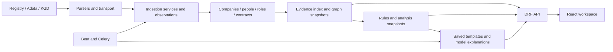

# IZ2 architecture

Current implementation, reviewed 10 October 2026. Historical measurements and
phase decisions remain in PHASE1–7; release findings are in FINAL_AUDIT.md.
Current startup and recovery commands are in [DEPLOY.md](../DEPLOY.md).

IZ2 is a modular Django application with a React/TypeScript workspace. PostgreSQL
stores evidence and durable results; Redis carries Celery jobs and shared account
quotas. One application image contains Django/Gunicorn and the compiled frontend.
There is no separate Next.js application or frontend server in production.

The thesis prototype supports inspection of procurement relationships. A shared
contact or a connected group is evidence for review, not proof of wrongdoing.
Court, bankruptcy, restricted-participant and tender-bid integrations remain
future work. Current ownership cannot be inferred from director names or
incomplete founder markup.

## Repository boundaries

| Location | Responsibility |
| --- | --- |
| `apps/ingestion/` | Parsers, transport, provenance, persistence and collection orchestration |
| `apps/companies/`, `apps/contracts/` | Company and contract models, compatibility pages |
| `apps/owners/` | Person/source identity and role history; existing package/table names retained |
| `apps/graph/` | Evidence index, stable groups, immutable snapshots, lineage and personal views |
| `apps/ai/` | Deterministic rules, analyses/templates and validated provider jobs |
| `apps/api/` | Versioned projections, accounts, permissions, staff jobs and shared throttling |
| `apps/core/` | Shared models, task entry points and operational management commands |
| `apps/dashboard/`, `apps/frontend/` | Compatibility dashboard and Django React entry/manifest integration |
| `config/` | Django/Celery settings, URLs, WSGI/ASGI, Gunicorn and container health/startup |
| `frontend/src/` | React pages, components, hooks, API bindings, localisation and shared `styles/` |
| `templates/`, `static/` | Django/legacy/API pages, local fonts, graph assets and licences |
| `logging_setup/` | Native process-safe file logging and retention |
| `scripts/` | Host-operated startup, audit, environment, backup and recovery tools |
| `deploy/` | Caddy configuration and HTTPS startup validation |
| `tests/` | Cross-cutting regression tests and synthetic source fixtures |
| `docs/` | Current architecture/operations plus dated audit and phase records |

App-specific tests live next to their domain. `frontend` owns its tests and
lockfile. `test.py` is the user's learning file, excluded from application tests.
Ignored `artifacts/` contains private backups, reports and the native model cache;
it must not enter Git or images. `static/frontend/` and `staticfiles/` are generated
assets. Virtual environments, dependencies, IDE settings and runtime schedules
are local state, not application modules.

## Data flow

Parsers fetch and normalise; ingestion services persist and orchestrate stages.
Views and commands do not implement an independent pipeline. Money uses Decimal.
Success, confirmed absence, source failure and not checked remain distinct.

Collection has independent bounded contract/profile/KGD stages, durable due
times, checkpoints, retries, per-host cooldowns and database leases. Contract
head catch-up, archive reconciliation and repair retain progress. A backlog
threshold lets enrichment catch up before more discovery. External HTML
pagination, quotas and source outages prevent a guarantee of complete coverage.

SourceObservation and SelectedFact retain source/date/version provenance.
Retrieval time is separate from legal applicability. Same-name people are not
merged without identity evidence. Directory grouping keeps source identities
separate. Graph person links require verified identity and applicable role
evidence; unknown dates remain unknown.

KGD registration and arrears are independent states. CompanyKgdState retains the
latest attempt and last successful result per company/source. Registration
requires returned identity/type confirmation; debt requests additionally require
company-specific entitlement. Entrepreneur registration does not establish
support for entrepreneur debt checks. A failed/unavailable check never means zero
debt, and company debt is not assigned to a director or owner.

## Saved graphs and explanations

RiskCluster has a stable UUID; GraphSnapshot and ClusterLineage preserve
membership/evidence history through changes, splits and merges. Feature indexes
avoid production all-pairs comparison. Repeat collection without meaningful
changes does not recreate snapshots or explanations. Compatibility graph helpers
remain for existing routes and tests.

AnalysisSnapshot binds deterministic, capped review findings to exact saved
evidence. The public score is a review index, not a probability. Explanation
stores immutable templates or model text. AnalysisState points to the current
result. Jobs use deduplication, exact version binding and latest-request fencing;
late output cannot replace a newer requested result. Personal GraphViewState is
separate from analytical hashes and uses optimistic revision checks.

The optional Qwen model writes short English, evidence-cited prose from prepared
facts; aliases are expanded from frozen labels. Schema/reference/number and
contradiction guards plus a bounded local repair reject some invalid output.
They are not semantic proof: AUD-002 remains open. Failure keeps a saved template.
The model never decides identity, edges or public review scores. Experimental
estimates remain separate. Paid providers require explicit opt-in.

GET only reads saved domain results. Graph refresh and generation run through
explicit staff jobs or authorised background ingestion. Docker starts with
collection and automatic model generation disabled; the native collector helper
has a separately authorised opt-in. Visiting a page or switching language does
not collect or rewrite evidence.

## API and interface

`/app/` is the same-origin React workspace; `/api/v1/` is DRF; `/api/v1/docs/`
is the locally bundled English Swagger reference. `/legacy/` and existing
template detail routes remain supported. Vite entry and lazy chunks use the
original Vite hashes, avoiding duplicate React contexts from double hashing.

Public API projections omit IIN, raw observations and model estimates. Accounts
use Django sessions and CSRF. Users manage their own graph views, username and
password; email is read-only. Only staff can request recalculation/generation.
There is no HTTP collection-start endpoint. Redis shares account quotas across
processes and account operations fail closed when that backend is unavailable.

The accepted interface has EN/RU presentation, responsive directories, D3 graph
interaction, saved layouts, evidence/history panels and controllable motion.
Original identifiers, source labels and saved explanation language do not change.
Django and Celery use Asia/Qyzylorda; timestamps remain UTC-aware and business
dates follow that local calendar. Native and Linux boundary tests cover this.

## Deployment and operations

One `docker-compose.yml` runs PostgreSQL 17, Redis, a migration gate, web,
ingestion worker, AI worker and beat. Optional profiles add CPU Ollama
(`local-ai`), NVIDIA Ollama (`local-ai-gpu`) and Caddy (`https`). Environment
preparation writes the profile selection and matching settings together. The
CPU/GPU profiles are alternatives. `Dockerfile` builds the shared image using a
Node stage for React and a Python runtime; Node is absent from the runtime.

The legacy default project/volume names remain compatible. Persistent database,
Redis, model and certificate volumes are separate from images. Backend processes
run as a non-root user with a read-only filesystem, restricted capabilities,
resource/log bounds and health checks. Only Caddy publishes public ports; the
direct web diagnostic port binds to loopback. The proxy validates secure-cookie,
redirect, allowed-origin and single-peer trust configuration before starting.

Backups/restores require quiet writers and an empty restore target. Checksums,
row/schema/sequence manifests are compared; tools do not erase existing data.
Native-to-Linux transfer, HTTP/HTTPS account/view persistence, outage handling
and a synthetic CPU Qwen task were verified on isolated projects. NVIDIA
execution, real-domain certificate issuance, server load and off-host backup
operations still require target-host verification. Current cleanup checks are
recorded in [REPOSITORY_AUDIT.md](REPOSITORY_AUDIT.md).

The user performs Git operations. Public release still depends on unresolved
audit findings and publication policy; packaging is not release approval.
