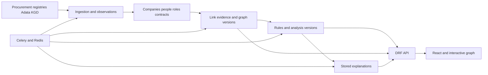

# IZ2 architecture

Recorded on 5 October 2026; analysis status updated on 7 October 2026. This document distinguishes implemented behaviour from the target thesis architecture. Ingestion, provenance, identity and KGD checks are implemented; registration and complete zero arrears are verified for one company. Indexed evidence, immutable graph snapshots/lineage, personal views and explicit background recalculation are implemented. Phase 5 adds immutable analysis/explanations, deterministic review priority and optional validated local model presentations. The accepted graph prototype awaits further design in Phase 7. Broader KGD coverage, calibrated prediction, DRF and React remain future work.

Collect procurement/company information, show verifiable links, and explain observed patterns. A link does not establish wrongdoing; group contract volume is not damage. Conclusions require sources, temporal context, and confidence.

Product brand: IZ2; Python package/repository: `iz2`; intended domain: `iz2.kz`.
The original scope includes verified company/person history from additional open
registers. Court/blacklist/bankruptcy adapters and owner-specific findings remain
future source work, with exact subject identity and dated evidence required.
The rename preserves database/volume identifiers and personal-view keys; Compose
pins the existing default namespace to avoid selecting fresh volumes after a
directory rename. It does not register or deploy the intended domain.

Related: [audit](AUDIT.md), [baseline](BASELINE.md), [recovery](RECOVERY.md), [roadmap](ROADMAP.md), [repository rules](../AGENTS.md).

A procurement analyst checking company links is the initial design assumption. Audience, thesis deadline, and API/AI budgets are unconfirmed and may change priorities. All project deliverables use English; Russian website localisation follows completion of the English interface. Original source labels/data retain their source language.

## Requirements status

| Requirement | Status |
| --- | --- |
| Consolidate/optimise parsers | Implemented in Phase 2: shared session, pacing, caches, checkpoints, lease, resumable stages |
| KGD information | Taxpayer/arrears adapters and retained checks accepted for one company's registration/zero-arrears scenario; broader coverage unverified |
| DRF backend and React | Requested; gradual transition retaining Django/migrations |
| Persist graph/analysis/explanations | Immutable graph/analysis/text histories and personal views implemented |
| Update explanations after significant changes | Authorised graph refresh atomically updates affected analyses/templates; model generation remains explicit |
| Substantial graph improvement | Implemented and prototype accepted; final graph/interface polish follows in Phase 7 |
| Attractive, usable reference-based UI | Requested; user references pending, final style undecided |
| Docker backend/Celery/Redis/database | Fixed and verified in Phase 1: shared build, migration gate, health checks |
| README/startup documentation | Updated as phases progress |
| Specific LLM/budget/public startup | Free local Qwen3:4b selected for verification; paid use opt-in, benefit/calibration and public pilot remain unapproved |

## Existing system

Django/PostgreSQL store suppliers, contracts, owners, directors, and clusters. Pages use templates/JavaScript/Bootstrap; D3 draws graphs. DRF/React are absent.

The common [parser directory](../apps/ingestion/parsers) handles contracts, participants, Adata and KGD. The shared [service](../apps/ingestion/services.py) stores observations/roles/stage progress; commands and [Celery](../apps/core/tasks.py) call it directly. [Compose](../docker-compose.yml) defines PostgreSQL, Redis, migrate, web, worker, and beat. Automatic collection and manual KGD checks default off. See [PHASE1.md](PHASE1.md), [PHASE2.md](PHASE2.md) and [PHASE3.md](PHASE3.md).

| Area | Implementation | Limitation |
| --- | --- | --- |
| Companies/contracts | [Supplier](../apps/companies/models.py) supplier/customer roles; [Contract](../apps/contracts/models.py) customer FK; SourceObservation/SelectedFact | Supplier name retained for compatibility; source completeness/freshness unproven |
| People/roles | [PersonIdentity, Owner, Director, Ownership, Directorship](../apps/owners/models.py), source identities/candidates | Evidence and observed history exist; confirmed IIN/legal periods/ownership require external sources |
| KGD company checks | SourceObservation plus CompanyKgdState; identity-gated adapters, manual leased pipeline; Phase 5 uses validated dated company results | Live registration/zero-arrears accepted for one company; positive/stale/failure scoring uses fixtures; broader coverage unverified |
| Graph | RiskCluster, EvidenceEdge, GraphInputState, GraphSnapshot, ClusterLineage; indexed atomic [service](../apps/graph/services.py) | All inputs still read for dirty detection; publication is scoped; legacy score remains uncalibrated |
| Analysis/explanations | [Rules](../apps/ai/rules.py), immutable AnalysisSnapshot/Explanation, current AnalysisState, legacy-text compatibility | Review priority is uncalibrated; bidding data unavailable; company/dashboard indices remain labelled legacy |
| LLM | [Provider boundary](../apps/ai/providers.py), schema validation, deduplicated jobs/latest-request fencing, saved fallback | Finding order/wording variants only; no proven readability/prediction advantage; paid transport tested offline |
| Background work | Celery, beat, IngestionRun, fenced lease | Resumable shared pipeline; lease protects service calls, not arbitrary scripts |
| UI | Templates/Bootstrap/D3, saved graph history, GraphViewState, search/evidence/path navigation | User accepted graph prototype; automated browser/dense/responsive visual checks unverified; final design/React follow references |

The [audit](AUDIT.md) records defects/check boundaries. Architecture documentation does not verify source quality/completeness.

## Target design

A modular Django/DRF backend, React frontend, PostgreSQL, Celery, and Redis. The thesis uses one backend divided by domain. Graph databases/microservices require a measured reason and are not planned now.

PostgreSQL holds durable results/job state; Redis provides queues/cache. Cache loss must not remove graph/explanation versions. Deduplication needs database constraints/current-version checks as well as temporary locks.

| Module | Responsibility |
| --- | --- |
| `apps.ingestion` | Source adapters, transport, normalisation, observations, runs, checkpoints |
| `apps.companies` | Companies, verified identifiers, supplier/customer roles |
| `apps.owners` or future people module | Identity matching, temporal directorship/ownership |
| `apps.contracts` | Contracts/changes; lots/bidders only with available sources |
| `apps.graph` | Link evidence, stable groups, snapshots, membership history |
| `apps.ai` | Rules/findings/template and LLM explanations |
| `apps.core` | Shared technical mechanisms without hidden business orchestration |
| `frontend` | React/API requests/pages/graph interaction |

Future people-module naming/serializer placement will be decided during implementation. Table migration must preserve original-record links.

## Ingestion and provenance

Parsers in `apps/ingestion/parsers/` neither invoke later stages nor persist models. Transport handles timeouts/retries/pacing/connection reuse. Ingestion validates, saves observations, and selects fields. Actual priorities/modes/missing-field policy are in [PHASE2.md](PHASE2.md).

Distinguish success, object absence, source unavailability, malformed response, and not checked. Never reduce these to empty values or zero debt.

| Entity | Stored information |
| --- | --- |
| `IngestionRun` | Source/mode/stages/times/status/counters/diagnostics |
| `SourceCheckpoint` | Confirmed source/stream progress |
| `SourceObservation` | Subject/field/raw and normalised values/source/dates/parser version |
| `IdentityCandidate` | Possible match, evidence, confidence, decision |
| `SelectedFact`, `IngestionIssue`, `IngestionLease` | Selected provenance, retryable errors, concurrent publication fencing |
| `PersonIdentity`, `PersonSourceIdentity` | Verified or isolated identity, source, observed name |
| `CompanyKgdState` (Phase 3) | Company/source, latest attempt and retained last successful observation; reporting dates kept in evidence |

Initial loading, regular updates, and retries are separate. Checkpoints advance after confirmed processing, retaining partial-page state. Repeats produce the same domain data without duplicates.

Verified BIN is an exact company key. Name similarity finds candidates/variants. Names alone cannot merge people without reliable identifiers/supporting evidence. Legacy false merges must be reversible without losing observations.

Keep retrieval dates separate from effective periods. Unknown periods stay unknown. Simultaneous leadership requires proven overlap. Company tax debt is not owner debt.

KGD runs are separate from contract/enrichment/cluster stages and check a fixed selection of up to 500 companies. Taxpayer lookup must confirm the exact BIN and legal-entity type before an arrears request. Private portal/account credentials never enter run options or observation URLs. Latest attempt and retained last success have separate references; cache reuse does not advance retrieval time. Company-page GET reads state only. KGD does not alter identities or graph edges. Phase 5 explicitly prepares dated company-financial findings from saved observations, preserving current unknowns after source failure. Verification scope is in [PHASE3.md](PHASE3.md) and [PHASE5.md](PHASE5.md).

## Evidence and analysis

`EvidenceEdge` links observations with type, participants, normalised feature, interval, sources, and confidence. Graph and explanation use the same evidence.

Feature indexes and shared person/contact nodes replace all-pairs comparison in production graph publication. Contacts used by more than 20 companies remain weak evidence but do not form groups. This is a provisional conservative heuristic, not a calibrated risk rule. The legacy pair-projection helper remains for compatibility; graph pages read snapshots. See [PHASE4.md](PHASE4.md).

Separate identity, link reliability, and behavioural risk. Connected-component membership proves neither every pair's direct relation nor uniform risk. Version group rules/scoring.

A rule returns a finding with code/version, participants, evidence, period, confidence, score contribution, and interpretation limits. A business centre/service provider may explain shared contacts. Calibrate risk on labelled cases rather than automatically inheriting current thresholds.

Coordinated-bidding patterns need bidders, bids, lots, and results. Contracts alone cannot establish coordinated bids or winner rotation.

## Persisting graph and explanations

Separate persistent groups, versions, and personal views.

| Entity | Purpose |
| --- | --- |
| `RiskCluster` (implemented) | Permanent UUID/current GraphSnapshot |
| `GraphSnapshot` (implemented) | Immutable membership, significant nodes, copied link evidence, graph hash and changes |
| `ClusterLineage` (implemented) | Merge/split/retirement/reactivation transitions |
| `AnalysisSnapshot` (implemented) | Immutable inputs/findings/metrics/limitations/rule versions, exact graph binding |
| `Explanation` (implemented) | Immutable text/status/language/provider/model/prompt/analysis link, separate experimental estimate |
| `AnalysisState` (implemented) | Current published analysis/text |
| `AnalysisJob`, `AnalysisTarget` (implemented) | Durable deduplicated jobs and latest-request publication fence |
| `GraphViewState` (implemented) | User/state-schema version/coordinates/pins/zoom/filters, optimistic revision checks |

`graph_hash` covers canonical significant nodes/edges. `analysis_hash` also covers rule-used facts/metrics and relevant rule/normaliser versions. Repeat retrieval dates, row order, and run IDs do not change hashes alone. If a rule uses fact age, include an explicit analysis date/evaluation period.

Reuse text by exact analysis binding/hash, prompt/template version, provider configuration/model revision, and language. Changed facts/rules/explanation parameters create new results. Retrieval-only observation changes reuse the original published references. Freshness-category changes affect the analysis hash. Database constraints and cluster row locks handle concurrent requests. Initially prepare English; add Russian variants later.

Rebuilds detect dirty company inputs and close impact over previous/current features and active memberships. The index still reads all inputs; unaffected groups receive no recreated versions. Exact composition wins, including a possible archived UUID; otherwise maximum overlap, Jaccard and oldest record determine continuation. Splits retain one UUID and can reactivate exact archived compositions or create new UUIDs. Old links and predecessor snapshots remain readable through lineage. GraphRebuildJob deduplicates staff-requested work, enqueues after commit, shares the ingestion lease and records exact resulting versions. See the verified scenarios in [PHASE4.md](PHASE4.md).

Jobs target exact snapshots. Late output stays in history without replacing current text. Show version, calculation time, and explanation state. GET reads saved results; authorised POST starts work.

Viewing state does not affect analytical hashes. Preserve existing coordinates where possible; place added nodes near neighbours and provide explicit reset.

## AI role

Deterministic rules establish matches/patterns. Templates provide the first explanation and LLM fallback.

The implemented LLM contract receives prepared findings without names/BINs/IINs/contacts and returns only finding order and predefined English wording variants. Closed-schema validation rejects arbitrary prose and invented references. The renderer adds saved company labels after validation. The LLM cannot create edges or decide identity. Full narrative generation is not implemented.

Template is the default provider; local Ollama Qwen3:4b is the free candidate. OpenAI/OpenRouter adapters are configured through environment settings; paid calls require explicit opt-in. Saved fallbacks keep the system useful during provider failure. Optional model scores stay separate for staff evaluation and never replace the public rules without independent evidence. Pin model names/revisions manually; floating aliases are not automatically resolved. See [PHASE5.md](PHASE5.md) for limits and measured results.

## API and interface

`/api/v1/` exposes companies/contracts/people/clusters/snapshots/evidence/explanations/job states without HTML fragments. Require validated filters/pagination/write permissions/OpenAPI.

Initially propose same-origin React/API with Django sessions and CSRF on writes. Confirm with access scenarios; revisit for separate public/mobile clients. Only permitted roles launch collection/costly generation.

React uses TypeScript. Prototype graph libraries for layout quality, density, interaction, coordinates, maintenance. React does not force Bootstrap removal; choose UI components from future references.

Phase 4 improves graph readability, highlighting, search, filters, zoom, legend, evidence, and layout restoration. Final colours/typography/components/page composition follow user references. Substantial graph improvement must not wait for final polishing. Russian website localisation follows the complete English interface.

## Deployment

Compose runs PostgreSQL/Redis/migrate/web/worker/beat. Optional `local-ai` adds Ollama and a model-initialisation gate with persistent weights. Phase 5 validates both Compose configurations; actual local-ai profile startup/GPU operation remains unverified. Integrate React into builds or add a service in its phase.

Install from lockfile; app services wait for successful migration, not independent concurrent migrations. Keep secrets outside images/repository. Persist data in volumes; verify backups separately. The user performs Git operations.

## Key decisions

| Decision | Status/reason |
| --- | --- |
| Modular Django/PostgreSQL | Implemented; Phase 2 separated ingestion |
| DRF/React | User requirement; roadmap proposes implementation |
| No name-only person merge | Implemented: scoped identities/candidates/IIN evidence/legacy isolation |
| Observations/temporal roles | Implemented; unknown legal boundaries remain unknown |
| Tax data linked to exact legal-entity BIN | Implemented and accepted for one company's registration/zero-arrears scenario |
| Shared evidence graph | Implemented for grouping, graph rendering and compatibility template; Phase 5 rules consume snapshots |
| Stable UUID/snapshots/lineage | Implemented; repeat, addition, retirement, merge/split and restoration scenarios verified |
| Analysis hashes separate from views | Implemented: graph/semantic fact/rule hashes exclude personal views |
| Versioned background results | Graph/analysis jobs fence publication; late model output remains in history; GET reads saved data |
| Rules/templates before LLM | Implemented with capped categories/no group-size bonus; public indices remain uncalibrated |
| Model scoring | User authorised considering it if better; experimental estimates remain separate until independent evaluation |
| Same-origin sessions initially | Implemented for graph writes/CSRF; broader API roles/publication follow in Phase 6 |
| English first, Russian localisation later | User instruction; preserve original source data |

## Thesis version and further development

Proposed minimum: reproducible limited-sample collection, observations, available KGD service, evidence, graph/analysis versions, explanations, DRF/React/Compose. KGD depends on actual access; fixture demonstrations must not appear to be current checks.

1. Find a company by BIN and inspect sources/contracts.
2. Inspect each selected cluster edge through observations.
3. Repeat unchanged collection and show retained versions/no new LLM calls.
4. Add a linked company; show new version, retained history/layout.
5. Demonstrate namesakes/non-overlapping roles without false identity/simultaneity.
6. Make a source unavailable; show correct check state, resume, preserved data.

Use permitted/anonymised examples with manual labels. Measure matching precision/recall, false links by type, temporal correctness, supported explanation claims, SQL/runtime on fixed inputs, repeat LLM counts/cost. Set targets after baseline; unknown values are not achieved results.

A pilot additionally needs roles/action audit, personal-data policy, monitoring/recovery/limits/source-use review. A public startup, pricing, and specific customer scenarios are not approved scope.
