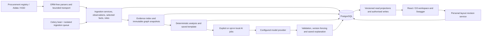

# IZ2 final audit

**Audit date:** 10 October 2026, Asia/Qyzylorda (UTC+05:00).  
**Decision:** suitable for a supervised, accurately scoped relationship-analysis demonstration; useful for local investigation support; **not ready for an unattended public launch or a claim of validated coordinated-bidding detection**.  
**Change policy:** audit only. No application fixes, dependency changes, working migrations, source collection, working graph/text regeneration, or Git mutations were performed.

**Post-audit follow-up, 10 October 2026:** the user subsequently authorised and
completed the AUD-001 timezone correction. Django/Celery now share
`Asia/Qyzylorda` with UTC-aware storage; ten new boundary regressions and all
583 PostgreSQL tests passed. Native/Linux configuration and bounded read-only
impact checks passed; no working history was rewritten. Details are recorded in
[PHASE7.md](PHASE7.md#kazakhstan-dates-and-authorised-enru-interface-10-october-2026).
The findings and test inventory below describe the original audited snapshot.
This remediation does not close the other findings or change the public-release
verdict.

**Linux preparation follow-up, 10 October 2026:** deployment-wide authentication
limits/trusted-peer policy (AUD-004), framing protection (AUD-011) and Docker
resource/log bounds (part of AUD-017) were implemented and independently checked.
Full-stack startup, native-data transfer/recovery, local HTTPS, restart/outage
behaviour and one real synthetic Qwen job passed. Scope and remaining public
release gates are recorded in [DEPLOYMENT_CHECK.md](DEPLOYMENT_CHECK.md). The
historical audit below remains unchanged; AUD-002/AUD-010 and other findings are
not closed by packaging work.

## 1. Executive summary

IZ2 is a substantial working prototype, not merely a visual mock-up. Collection services, source observations, exact-identifier person matching, versioned relationship graphs, deterministic review rules, saved model explanations, accounts and personal graph layouts are implemented. Fresh backend/frontend tests passed, an isolated Linux image built and ran, actual browser flows worked, and a fresh PostgreSQL backup restored with matching table contents.

The statement that the whole intended system is finished is not supported. The most important distinction is between **finding relationship evidence** and **detecting bidding behaviour**. Current inputs do not describe complete tender participation, competing bids, lots and outcomes. Public scores are manually specified review priorities, not trained or calibrated predictions. Qwen is a genuine pretrained machine-learning component used to present prepared facts; it is not a procurement-behaviour detector. The application itself correctly marks behavioural risk as not assessable.

No **P0** defect was established. Three substantial technical issues deserve early attention: the wrong Django business timezone affects date-dependent decisions; unsupported novel prose can pass the AI validator and publish; and authentication throttling is local to each process rather than deployment-wide. The first two matter to correctness and demonstration credibility; the third is a public-access gate. Additional reproduced issues affect manual-import recovery, corrected person names, replacement-worker status and collection counters. These coexist with strong transaction, history, revision and ownership safeguards; they do not establish wholesale data corruption.

| Target | Verdict | Conditions |
| --- | --- | --- |
| Thesis defence | **Conditionally ready for a relationship-evidence MVP demonstration** | Correct the timezone; use reviewed saved explanations/templates; explicitly delimit the thesis claims; rehearse a fixed, labelled demonstration. A claim of completed, empirically validated coordinated-bidding/ML detection is not ready. |
| Local development and investigation | **Usable with known limitations** | Treat missing checks as unknown, inspect source dates and keep backups. Collection workers were already stopped at audit entry, so no ongoing collection should be assumed. |
| Small controlled pilot | **Not ready for unattended analytical publication** | Close the correctness/recovery findings, define publication and freshness policies, rehearse restart/recovery, and verify source entitlement and target-host operation. |
| Public launch | **Not ready** | In addition: shared authentication limits/proxy policy, patched dependencies, framing protection, release CI, operational bounds, deployment/TLS review and an explicit data-publication policy. |

The recommended immediate engineering task is **AUD-001: establish one explicit Kazakhstan date policy and cover its boundary cases**. It is small, directly reproducible and affects multiple domains. AUD-002 must be closed before publishing newly generated prose without review. This report does not authorise either change.

## 2. Version, scope and checks actually executed

### 2.1 Audited source and preservation

- Branch: `master`.
- HEAD: `fd5ea7d8d6e0c63ff72bb0351106533856a1a284`.
- Commit subject/date: `Add resumable collection, enrichment scheduling and automatic local AI`, 9 October 2026, 11:40:42 +05:00.
- The actual audited version is **HEAD plus the existing local changes**: 62 modified tracked files and nine untracked application/document files. It is not reproducible by checking out HEAD alone.
- Initial manifest: 417 files, captured at `2026-10-10T04:08:23.631709Z`; SHA-256 `a42f78b6484bd978fc53d51d75b23dc546081a53e15e650fb9b2857299830f90`. This is the audit's file-map hash, not a Git tree hash or release signature.
- The pre-existing untracked files include `apps/api/catalogue.py`, director-identifier tests, two data-readiness documents, `BrandMark.tsx`, entity/home frontend tests, `EntityEvidence.tsx` and `refinement.css`.
- Read-only Git inventory/history/diffs were authorised. No add/commit/branch/reset/stash/clean/push was performed. User changes, `.env`, learning `test.py`, locks and the unrelated `next-app/` starter were preserved.
- At final comparison, all original file hashes, branch and commit matched; no new non-report source file appeared. The only requested repository deliverable is this report. Scripts, dumps, synthetic databases and screenshots stay under ignored `artifacts/final-audit/`.

Primary audit records are private local artifacts, not committed datasets. They contain diagnostic scripts and aggregate results; raw backup contents must remain ignored. Do not publish these artifacts wholesale. No working names, person identifiers, tokens, source bodies or private contacts are reproduced in this report.

### 2.2 Environment and versions

| Component | Observed version/configuration |
| --- | --- |
| Host | Windows 11, build 10.0.26300; native Python 3.13.5 |
| PostgreSQL | 17.6, native Windows; 70 applied migrations in the fresh restored snapshot |
| Backend | Django 6.0.6; DRF 3.17.2; drf-spectacular 0.29.0; psycopg2-binary 2.9.12 |
| Tasks/HTTP/static | Celery 5.6.3; redis Python client 8.0.0; requests 2.34.2; curl-cffi 0.15.0; WhiteNoise 6.12.0; Gunicorn 26.0.0 |
| Frontend | Node 24.21.0; npm 11.19.0; React 19.3.0; D3 7.9.0; TypeScript 7.0.2; Vite 8.3.3; Vitest 5.0.3 |
| Browser | Chromium 154.0.8037.98 through Playwright MCP |
| Docker | Desktop 4.44.3, Engine 28.3.2 Linux; built image Python 3.13.16, non-root UID 10001 |
| Audit model | Ollama 0.40.0; `qwen3:4b`, Q4_K_M; RTX 4060 CUDA, 37/37 layers offloaded, context 4096 |
| Resolved model digest | `359d7dd4bcdab3d86b87d73ac27966f4dbb9f5efdfcc75d34a8764a09474fae7` |
| Analytical versions | graph `evidence-graph-4.0`; rules/analysis 5.0; prompt `evidence-presentation-5.3`; readable document/template 5.2 |

Python dependency ranges in `pyproject.toml` are not the installed-version evidence; installed metadata and the lock were inspected. Docker's floating Python base produced a different patch version from the native environment. This is compatible execution evidence, not proof of bit-identical builds. The Redis **client** version above is not a measured Redis server version.

### 2.3 Services and audit isolation

At audit entry, the user's PostgreSQL (5432) and Redis (6379) were available. Native ingestion worker, AI worker and beat were **already stopped**, as reported by `scripts/background.ps1 -Action Status`; port 8000 and Ollama 11434 had no listener. Historical successful cycles do not imply currently running collection. No user-owned service was started, stopped or reconfigured.

Working-data aggregates used a single `REPEATABLE READ, READ ONLY` PostgreSQL transaction with a statement timeout. A later, separately timestamped graph aggregate was also consistent/read-only. Browser reads of working data used an audit-owned normal-settings preview on 18801 with GET/HEAD-only HTTP and read-only database sessions. Browser account/layout writes used a separate synthetic SQLite preview on 18802; this does not replace PostgreSQL concurrency tests.

All backend test databases used unique audit names. Docker project `iz2-final-audit-20261010` had its own volumes, synthetic credentials, no native data/env mounts, an internal network and collection/paid/model flags disabled. An audit override bounded resources. HTTP checks ran inside the web container namespace because this deliberately internal network did not publish the host port on this Docker Desktop configuration. This was an isolation condition, not an application defect. Native synthetic inference used only owned port 11439 and a copied model cache, with no weight download. No working queue was consumed or purged.

All owned preview/model processes and Docker containers/network/volumes were stopped/removed after checks; owned PostgreSQL test/restore databases were dropped. Original PostgreSQL and Redis remained listening. Synthetic evidence and the ignored backup remain available locally; the original model cache was preserved.

### 2.4 Fresh verification journal

Commands below describe completed checks, **not commands the user must run now**. Temporary harnesses explicitly isolate settings/DBs; do not replace them with an unrestricted working-data test invocation.

| Command or scenario | Actual result and environment | Duration / limits |
| --- | --- | --- |
| Read-only Git inventory and file manifest | HEAD/local version recorded; 417 hashes preserved | Baseline and final comparison; no Git mutation |
| `python -B artifacts/final-audit/backend_tests.py` | **544 application tests passed**, PostgreSQL, 0 failures/errors/skips; owned DB dropped | 111.709 s including setup/teardown |
| `python -B artifacts/final-audit/infrastructure_tests.py` | **29 infrastructure tests passed**, 0 failures/errors/skips; owned DB absent afterwards | 8.723 s; learning `test.py` excluded |
| `npm.cmd test -- --maxWorkers=2 --reporter=json --outputFile=../artifacts/final-audit/frontend-tests.json` | **120 tests passed**, 0 failed/pending | Fresh Vitest JSON; jsdom/mocked WebGL is not browser rendering proof |
| `npm.cmd exec -- tsc --noEmit --incremental --tsBuildInfoFile ../artifacts/final-audit/typescript.tsbuildinfo` | Passed | Audit build cache only; no source output |
| `npm.cmd exec -- vite build --outDir ../artifacts/final-audit/frontend-build --emptyOutDir` | Passed, 1,183 modules | Vite reported 0.549 s; isolated output; normal frontend static directory untouched |
| `npm.cmd run format:check` | Passed | About 5.36 s; no formatter writes |
| Isolated `check`, `makemigrations --check --dry-run`, strict `spectacular --validate --fail-on-warn` | All passed; no migration drift | 0.614 / 0.127 / 0.678 s; no working migration |
| Ingestion diagnostic harness, separate PostgreSQL | Four defect reproducers completed: manual retry gap, stale verified name, stage counter, lease status race | 7.557 s; these reproduce defects and are not four additional application pass claims |
| Consistent working aggregate | Counts, dates, duplicates, source/role/debt coverage | 1.154 s; snapshot 04:07:45.851811 UTC; no source calls |
| Graph/AI validator, timezone, deadline, impact diagnostics | Findings AUD-001/002/012/013 reproduced on isolated data/loopback | Validator harness 4.923 s; deadline 7.628 s against 5 s; in-memory impact 0.8771 s |
| Four real synthetic local-model jobs | **Two accepted, two safe template fallbacks**; all repeat requests reused saved results | 17.368–20.804 s/job; eight local requests including repairs; no paid/source calls |
| Fresh dependency and secret checks | Frontend npm audit zero advisories; Python 15 unique GHSA IDs on four locked packages; zero configured-secret matches | 61 Python lock packages, 382 tracked files and 26 commits inspected; applicability below; no full security certification |
| Synthetic secure `check --deploy`; two-process throttle | Missing framing middleware W002; each process accepted 10 attempts independently | Throttle 2.25 s; no real login attack |
| Docker frozen build | Passed: backend/npm install, frontend, 233 static files/631 postprocessed assets | 93.38 s; application/locks unchanged |
| Isolated default Docker start and HTTP smoke | Startup passed; 70 migrations; **69 HTTP checks passed**, including 47 unique assets, accounts/CSRF/permissions/body/query limits | 27.81 s startup; smoke 1.06 s; no source/model work |
| Full/local-AI Compose resolution | Nine-service configuration resolves | Configuration only; model-container execution/GPU and working-data transfer not proved |
| Browser account and graph flows | Sign-up/sign-in, username, read-only email, password, other-session invalidation, logout; guest/account save/reset/reload/remove; fresh-context restore and stale-tab 409 | Real Chromium + isolated synthetic SQLite; actual API requests, not mocked success |
| Browser routes/responsiveness | Nine workspace routes at 320/768/1440/1920: no page-width overflow or unexpected JS exception; Swagger four widths and native filtered GET 200/one record | 36 workspace viewport-route checks plus four Swagger widths; physical touch/screen readers untested |
| Browser failure/history/dense graph | API abort → visible error → successful retry; empty search; direct missing ID; ordering/pagination; actual historical v1; 101-node graph, search/filter/pin controls | Dense-label limitation and weak 404 messaging reproduced; no working writes |
| Controlled API performance | 1,000 synthetic companies/people/contracts/roles and 100 ten-member clusters; 20 scenarios ×3 measured reads, constant list query counts | In-memory SQLite, 12.52 s harness; not PostgreSQL load/production latency |
| Pure D3 CPU benchmark | 50/200/500/1,000 nodes; median synchronous ticks 37.56/104.94/292.65/915.94 ms | Three samples/size, excludes browser DOM/paint; no FPS claim |
| Fresh `backup_database.py` recovery | Matching columns/counts/multiset hashes for **51 tables, 18,890 rows, 70 migrations**; own restored DB dropped | 5.626 s; shared exported read-only snapshot; dump checksum rechecked |

The backup was captured at 04:41:52 UTC. It verifies table contents and migrations, not sequence values, role grants, index equivalence, external media, target-host disaster recovery time or complete Compose restoration. Dump size 1,451,792 bytes; SHA-256 `3e4f202950117e3953cb997ab0d954b3605c4f07671325603f8ee4d6050e68ff`.

Environment/harness issues were separated from defects: the sandbox initially denied Python/Docker access; escalated isolated execution worked. PowerShell rendered normal unittest stderr as a native-command warning although the saved runner results were exit 0 and successful. Audit-only selector mistakes, a temporary SelectedFact fixture mismatch and an undersized screenshot timeout were corrected in audit artifacts. The actual model probe exits nonzero when any case falls back; that is not a crash of all four jobs. No application was modified to make these checks pass.

Private evidence index: `baseline.json`, `preservation.json`, `backend-tests.json`, `infrastructure-tests.json`, `frontend-tests.json`, `offline-checks.json`, `browser-results.json`; subdirectories `ingestion/`, `graph-ai/`, `backend-ops/`, `recovery/`. Historical phase test counts remain historical and are not added to these totals.

## 3. Actual architecture and entry points

`manage.py` and `config/` start Django; `/app/` is the React/Vite workspace served through Django/WhiteNoise, `/api/v1/` is DRF, `/api/v1/docs/` is bundled Swagger, and `/legacy/` retains compatibility views. `frontend/` is the actual client. The unrelated `next-app/` remains excluded and is not an application entry point.

`apps/ingestion/collection.py:run_cycle` schedules independent bounded stages; `services.py:run_pipeline` owns persistence/resume/leases; `crawl.py` adds head/history/repair traversal. `observations.py` selects source-backed fields; `identities.py` resolves identifier-bound or source-scoped people. Graph services publish component/snapshot/lineage changes, AI services atomically bind analysis/templates, and model jobs use deduplication/final version checks. `apps/api` projects this state, with explicit staff-only job writes and own-user layout/account writes. GET reads saved domain results; session/CSRF bootstrap is a legitimate technical exception, not collection or inference.

Native collection is managed by `scripts/background.ps1` with separate ingestion/AI worker queues and owned process markers. Docker uses a multi-stage build, migration service, PostgreSQL/Redis and workers/beat. The full overlay and `local-ai` profile are opt-ins. The default web configuration is template-only and disables source collection; process-local native flags can differ. Do not infer worker settings from a web-process settings dump.

The modular monolith is appropriate. Current findings do not justify microservices, a graph database replacement, switching to Next.js or replacing Django. Transactional/versioned boundaries are strengths; the concrete duplication and large responsibility surfaces are described in section 12.

## 4. Capability → implementation → data → check → limit

| Claimed capability | Implementation | Available inputs | Fresh verification | Limit |
| --- | --- | --- | --- | --- |
| Contract discovery/update | Registry adapter, service import, bounded head/history/repair | 525 saved contracts | PostgreSQL tests, quarantine/resume diagnostic, snapshot aggregate | Archive convergence/live availability not checked; manual retry gap; contracts are not bids |
| Company profiles | Registry/Adata observations and selected facts | 813 companies; 313 default checked profiles | Subject/value consistency aggregate, API/browser lists/details | 500 outside checked scope; checked does not mean complete |
| People and roles | Exact identifier matching; scoped unverified identities; dated observations | 1,198 identity records, 117 verified, 115 default current verified people | Identity tests and source-binding aggregate | Name-only records remain unverified; no legal dates in 384 current roles; corrected-name bug |
| Registration and debt | Separate KGD registration/debt states, type/credential gates | 223 registration successes; three debt successes, all zero | Fixture regressions, saved-state snapshot, synthetic same-day diagnostic | Registration does not prove no debt; one configured company debt credential; IP debt unsupported |
| Relationship discovery | Shared verified roles/contact evidence; frequency-aware components | 14 active saved groups; 57 total snapshots across 23 historical/current groups | Graph suite, synthetic mass-contact check, actual browser version selection | Indirect path is not a direct affiliation or violation; weak contact is weak evidence |
| Dynamic graph/history | Stable UUIDs, merge/split lineage, saved hashes/differences | 34 lineage records, immutable snapshots | PostgreSQL suite and old/current browser reads | Versioned relationship changes, not temporal bidding-pattern inference; current projection is not arbitrary historical reconstruction |
| Review priority | Version 5.0 capped deterministic rules | 44 saved analyses | Rule totals and isolated publication checks | Heuristic, uncalibrated index; not probability, damage or judicial conclusion |
| Explanations | Prepared facts, local aliases, narrative checks, fallback, fencing | 94 historical/current texts: 42 Ollama ready, four Ollama fallback, 48 template ready | Four new real synthetic jobs; unsupported-prose reproducer | Two accepted/two fallback in new sample; semantic support not guaranteed; no independent usefulness experiment |
| Experimental model estimate | Separate optional blinded field | No validated prediction dataset/experiment | Code separation; real case produced null estimate | Never replaces public score; no accuracy/calibration claim |
| Accounts and layouts | Session/CSRF, strict serializers, own revisions/tombstones | Two working saved-view rows; audit writes synthetic only | Fresh PostgreSQL + browser + Docker HTTP | Distributed throttling/proxy policy incomplete; no email recovery/verification workflow demonstrated |
| Public API | Typed paginated saved projections and staff jobs | Existing saved entities/history | Strict schema, HTTP limits/auth, Swagger native GET | No ingestion-start endpoint; public privacy/release policy still needed |
| Courts/bankruptcy/restrictions/owner history | Some models/placeholders and explicit limits | Zero ownership/court/person-debt/bankruptcy records | Aggregate and code review | No operational integration; field/model existence is not a feature |

Primary data counts are from the 04:07:45 UTC snapshot; graph/text counts are from a separate 04:44:29 UTC read-only snapshot. Active group count was corroborated by the public saved directory. These are a dated local catalogue, not a statement of national coverage.

## 5. Findings register

Priority is tied to the actual target and trigger. **P0:** critical current failure; none confirmed. **P1:** substantial correctness/security issue or a central unsupported product claim. **P2:** important reliability, release or scalability work. **P3:** limited usability/hygiene. A release gate does not make every issue P1.

| ID | Priority | Type | Evidence | Finding and gate |
| --- | --- | --- | --- | --- |
| AUD-001 | P1 | bug / data quality | reproduced | Wrong business timezone; fix before date-dependent defence/pilot use |
| AUD-002 | P1 | analytical validity | reproduced | Unsupported AI prose can publish; gate unattended pilot/public explanation |
| AUD-003 | P1 conditional | missing capability | confirmed by code | Unqualified bidding-detection/ML thesis claim exceeds implementation; scope or research gate |
| AUD-004 | P1 public | security | reproduced | Authentication limits are process-local; public access gate |
| AUD-005 | P2 | bug / data quality | reproduced | Manual import quarantine cannot resume/repair; recovery/completeness gate |
| AUD-006 | P2 | data quality | reproduced | Corrected same-identifier person name remains stale |
| AUD-007 | P2 | bug / operations | reproduced | Expired worker can overwrite replacement run status; recovery gate |
| AUD-008 | P3 | operations | reproduced | Enrichment/KGD stage counters report zero records |
| AUD-009 | P2 | data quality / missing capability | reproduced snapshot; code confirmed | Partial source/debt coverage, backlog and unproved archive convergence |
| AUD-010 | P2 | security | confirmed affected versions | Python advisories need applicability/update triage; public gate |
| AUD-011 | P2 | security | reproduced | Missing framing policy; public deployment gate |
| AUD-012 | P2 | operations / performance | reproduced | Provider budget is not an absolute wall-clock deadline |
| AUD-013 | P2 | performance | code + synthetic reproduction | Graph input/impact work can be catalogue-wide |
| AUD-014 | P2 | UX / performance | browser + CPU reproduction | Dense full-fit labels unreadable; synchronous layout scales poorly |
| AUD-015 | P2 | operations / analytical validity | code + observed metadata | Actual model digest not resolved in saved provenance |
| AUD-016 | P2 | operations | confirmed repository inspection | No checked-in reproducible CI gate |
| AUD-017 | P2 | operations | confirmed by code | Unbounded long-running logs/resource policy |
| AUD-018 | P2 | documentation | confirmed by code/docs | Current architecture/deployment descriptions contradict implementation |
| AUD-019 | P3 | operations | confirmed by inventory | Two runtime logs remain tracked; no secret leak established |
| AUD-020 | P3 | UX | reproduced | Missing entity shown as generic rejected request with useless retry |

No unconfirmed hypothesis is promoted to a current vulnerability. Areas without execution proof appear separately in section 14.

## 6. Detailed findings and acceptance conditions

### AUD-001 — Kazakhstan date rules inherit Django's America/Chicago default

- Type: bug / data quality. Evidence: **reproduced**. Priority: **P1** because the civil-day mismatch affects more than display: source-date acceptance, current-role boundaries, graph dates and freshness.
- Location: `config/settings.py:33-34` defines language but the entire settings module contains no `TIME_ZONE`; `config/settings.py:134` sets only `CELERY_TIMEZONE='Asia/Almaty'`. Consumers: `apps/owners/querysets.py:9-17`, `apps/graph/evidence.py:71`, `apps/graph/services.py:300`, `apps/ai/jobs.py:39`, `apps/ai/services.py:28,47-49` and `apps/api/entities.py:104,321`.
- Trigger: a Kazakhstan business day differs from America/Chicago's civil date. The synthetic fixed timestamp was 2026-10-10T04:10:00Z (09:10 in Qyzylorda).
- Proof: isolated runtime returned `settings.TIME_ZONE='America/Chicago'`, `USE_TZ=True`, and `timezone.localdate(...)='2026-10-09'`. A valid synthetic KGD result with reporting date 2026-10-10 was classified `invalid` by `collect_inputs` because it appeared to be in the future. An isolated override to `Asia/Qyzylorda` classified the exact same record `fresh`.
- Impact: valid same-day checks can look unusable during Kazakhstan mornings; role start/end transitions and graph/analysis dates use the wrong day. This does not establish corruption of all existing records, and saved immutable histories must not be silently rewritten.
- Proposal: explicitly select the project's Kazakhstan business timezone, retain UTC-aware storage, align/test the Celery civil-time contract, and use one date policy across domain rules. Preserve old histories; decide separately whether affected current projections need an authorised refresh.
- Dependencies/cost: small configuration and regression change, followed by a read-only assessment of affected dated outputs; no source recollection is necessary to prove the fix.
- Acceptance/test: fixed UTC boundary cases before/after Kazakhstan midnight, role [start, end) boundaries, same-day KGD reporting dates and freshness thresholds must agree across API, rules and jobs. Use isolated settings/data; verify explicit timezone in both native and container startup.
- Blocking stage: pilot/public date-dependent use; fix before defence to avoid visibly incorrect dates. Basic local browsing remains usable.
- Evidence: `timezone_probe.py`, `timezone.json` in the graph/AI artifact directory. The test modified only the audit's synthetic SQLite database.

**Evidence location:** ignored `artifacts/final-audit/graph-ai/`; the described scenario and acceptance criteria above are the public audit record.

### AUD-002 — Unsupported free prose can be published as a successful evidence-cited explanation

- Type: analytical validity. Evidence: **reproduced**. Priority: **P1** for unreviewed publication, because a false adverse assertion can be attached to named companies while the job reports success.
- Location: `apps/ai/narrative.py:186-245` checks a finite set of words/patterns; `248-295` validates references, aliases and numbers but not factual entailment. `apps/ai/providers.py:259-304` accepts this validator result. `apps/ai/jobs.py:122-150` stores/publishes it, and `apps/ai/presentation.py:129-141` expands company labels locally.
- Trigger: a provider produces an unsupported paraphrase outside the guarded vocabulary while citing an existing finding. No malicious user access or provider compromise is required for an ordinary hallucination; an attacker-controlled response is not a demonstrated route in this audit.
- Proof: with only a saved shared-address finding, `{{C1}} and {{C2}} secretly divide procurement markets.` passed `validate_narrative`; a mocked provider completion containing it passed the real generation/job/publication path and saved status `succeeded`. An invented benign claim about separate purchasing teams also passed. The direct control `The companies colluded in their tender submissions.` was correctly rejected. Public priority remained 2, showing score separation works.
- Impact: structured citations indicate which fact the model referenced, but do not establish that the sentence follows from that fact. The working-data corpus was not shown to contain this text. Existing README correctly acknowledges that validation is not semantic proof; the issue is the remaining publication risk, not a hidden promise in README.
- Proposal: before unattended public output, either publish prepared constrained wording, require human approval of novel adverse prose, or impose a much narrower claim grammar. A second LLM verifier can assist review but cannot by itself certify truth. Keep explicit model/template provenance and easy access to exact facts. Build adversarial paraphrase and independently annotated support tests.
- Dependencies/cost: constrained fallback/approval policy is small-to-medium; broad natural-language grounding is an ongoing medium/large evaluation problem. Extending one regex is not adequate acceptance.
- Acceptance/test: the two reproduced unsupported claims never reach a publicly ready document; reviewed/templated benign records remain usable; every material factual assertion in a held-out corpus is manually assessed against evidence with reported denominators. Re-run stale-job, history and score-isolation tests.
- Blocking stage: unattended pilot/public AI presentation; not a blocker for a supervised defence using reviewed saved examples/templates and accurate limitations.
- Evidence: `diagnostics.py`, `diagnostics.json`. Synthetic provider injection was a diagnostic stub; no real source/provider was compromised or contacted by this test.

**Evidence location:** ignored `artifacts/final-audit/graph-ai/`; the described scenario and acceptance criteria above are the public audit record.

### AUD-003 — The completed-product claim exceeds the implemented bidding/ML capability

- Type: missing capability / analytical validity. Evidence: **confirmed by code**, plus current synthetic behavior. Priority: **P1 for the unqualified thesis claim**, P2 for a deliberately scoped relationship-evidence MVP.
- Location: `apps/ai/rules.py:8-12,137-160` uses saved contracts for descriptive totals and sets `behavioural_risk=None`, `behavioural_status='not_assessable'`; `apps/ai/providers.py:148` fixes bidder/outcome/person-history availability to false; `apps/ai/evaluation.py:5-26` compares supplied priorities without a learning or dataset-splitting pipeline. `apps/graph/evidence.py:27-29,131-148` is current-role filtering plus connected components.
- Trigger: describing the present release as validated coordinated-bidding detection, a trained ML detector, calibrated risk prediction or full historical reconstruction.
- Proof: review scores are explicit constants and capped sums; only descriptive contract count/amount/shared-customer metrics are calculated. Current source/code has no complete bid/lot-participation feature model, fitted classifier, independent label set or detection evaluation. The four real local-model jobs (eight HTTP requests including repairs) demonstrate pretrained LLM presentation, not detection accuracy. A role with dates 2020-01-01..2026-01-01 but current`is_current=False` is excluded even when `applicable(...,as_of=2025-01-01)` is requested.
- Impact: an examiner or pilot user could reasonably expect capabilities the application cannot demonstrate. README's current capability/limitation wording is considerably more accurate than an unqualified statement that the thesis objective is complete. ARTICLE_CONTEXT is explicitly historical, not a current experiment report.
- Proposal: immediately define a defensible MVP claim: versioned relationship evidence and manual-review support with pretrained-model explanations. If the full title must be met empirically, obtain lawful participant/bid/lot/outcome data, define time-window features and independent labels, build a simple baseline, use time/group-disjoint evaluation, and separately evaluate the incremental value of rules, graph features and model predictions. Keep company arrears separate from person history/coordination.
- Dependencies/cost: scope/defence wording and a reproducible demonstration protocol are small; additional data integration and a valid research experiment are large and source-dependent. Do not promise a completion date without source access and labels.
- Acceptance/test: every thesis/demo claim maps to implemented code, actual inputs and an executed scenario; any detection-quality claim has a predeclared target, labelled holdout, baseline and measured false positives/negatives. As-of CLI help must distinguish a current-projection filter from historical reconstruction.
- Blocking stage: defence if presenting unqualified completed bidding/ML detection; pilot/public offering of that capability. It does not block a clearly scoped local investigation-support MVP.
- Evidence: source above, `diagnostics.json` historical-as-of probe, real model report below. Missing datasets should be corroborated with the root audit's consistent read-only aggregate snapshot rather than inferring working counts here.

**Evidence location:** ignored `artifacts/final-audit/graph-ai/`; the described scenario and acceptance criteria above are the public audit record.

### AUD-004 — Authentication throttling is process-local and does not define a trusted-proxy client policy

- Type/status/priority: security; reproduced and confirmed by code; **P1 before public access**. Not a blocker for an offline thesis demonstration.
- Locations: `config/settings.py:228-242` (rates, `NUM_PROXIES=0`, no shared `CACHES`), `apps/api/auth.py:63-66`, `apps/api/accounts.py:148-151`, `Dockerfile:35` (two Gunicorn workers), `DEPLOY.md:112-116` (proxy deployment).
- Trigger: multiple application processes or deployment behind a reverse proxy; Django admin login is also outside the API throttle classes.
- Proof: `audit_tools.py throttle` instantiated the actual configured `ScopedRateThrottle` in two fresh processes for one synthetic source IP. Each accepted ten attempts and rejected the eleventh; combined accepted requests were 20 within 2.25 seconds. The backend was `LocMemCache` in both processes. No real login attempt was made.
- Impact: documented 10/minute is not a deployment-wide limit; process restarts reset it. With a conventional proxy, `NUM_PROXIES=0` groups clients by the proxy's source address, potentially blocking unrelated legitimate users. It deliberately avoids trusting spoofed forwarding headers but is not a completed production policy.
- Proposal: deploy a shared, atomic limiter or trusted reverse-proxy limit covering API and admin authentication; explicitly define trusted client-IP forwarding. Keep per-account and per-source dimensions where appropriate rather than blindly trusting arbitrary `X-Forwarded-For`.
- Cost/dependencies: small-to-medium, approximately 1–2 development days including proxy/container tests; requires deployment topology decision.
- Acceptance: 11 sequential requests spread across two workers exceed the shared ten-request limit; untrusted forwarded headers cannot reset it; two genuine clients behind the chosen proxy do not share one anonymous registration quota. Parallel/restart tests and admin-login policy are included.
- Evidence: `throttle-reproduction.json`.

**Evidence location:** ignored `artifacts/final-audit/backend-ops/`; the described scenario and acceptance criteria above are the public audit record.

### AUD-005 — Manual import quarantine cannot be resumed or consumed by repair

**Audit classification:** bug / data quality; reproduced; **P2**.

**Severity:** Medium. **Proof:** reproduced on isolated PostgreSQL; reachable through documented CLI and legacy task. **Locations:** `apps/ingestion/services.py:203`, `:238`, `:247`, `:261`, `:285`; `apps/ingestion/crawl.py:110`; `README.md:327`; `apps/core/tasks.py:25`.

The manual `initial/update/full` path advances `contract_rows_checked` and the page/offset for rejected contract parties, but persists only an `IngestionIssue` plus invalid observation, with no `ContractRetry` row. When the requested row limit has been consumed, `--resume` skips the contract loop because `checked == total` and immediately raises `contract_parties_incomplete` again. The repair stream reads only `ContractRetry`, so it cannot repair this rejection. Starting a brand-new head/update scan may rediscover it, but the promised saved-run continuation does not.

**Reproducer:** two synthetic contract rows, first valid, second raises `contract_party_identifier_missing`; first run saves one contract and becomes partial. Make the source valid, resume the same UUID: zero page/party calls, same error. Invoke repair: zero checked rows, second contract still absent. Working aggregate has two unresolved contract-party issues and zero retry rows; that is a corroborating queue shape, not proof of the exact production history of those rows.

**Impact:** documented retry/resume can remain permanently partial; older/manual entry points have a collection gap despite the newer background crawler having durable repair. This is also a concrete maintainability cost of keeping two contract ingestion algorithms.

**Suggested change:** share the row-acceptance/quarantine/repair service between CLI and scheduled streams, preserving existing mode/checkpoint compatibility. Persist enough normalized rejected-row context for durable retry. Resolve run issues only when the row really succeeds. Do not erase old issues or automatically replay working records during implementation.

**Effort:** about 1–2 engineering days plus isolated replay/backup verification. **Acceptance:** partial-party failure followed by same-UUID resume or repair imports exactly the missing row; no source-page drift loss, duplicate contract, extra unrelated fetch, or false succeeded status. Regression covers both CLI and scheduled paths, plus an interrupted repair.

**Stage gate:** fix before claiming comprehensive unattended collection/resumable manual import or public operations relying on these commands. A bounded thesis demonstration can proceed with this disclosed limitation and prechecked saved data.

**Evidence location:** ignored `artifacts/final-audit/ingestion/`; the described scenario and acceptance criteria above are the public audit record.

### AUD-006 — Corrected verified names do not update People and role labels

**Audit classification:** data quality; reproduced; **P2**.

**Severity:** Medium. **Proof:** reproduced with two source-confirmed observations sharing one exact identifier. **Locations:** `apps/ingestion/identities.py:65`–`:70`; `apps/api/entities.py:204`, `:298`, `:396`; graph label source `apps/graph/evidence.py:102`.

`resolve_person()` uses the verified IIN scope with `get_or_create`, but leaves an existing `PersonIdentity.full_name` and its Director/Owner representation unchanged. A newer source-confirmed spelling/name correction updates `Supplier.director_name` and the current role's source observation, yet the People name/search and API `observed_name` keep the first saved spelling. `observed_name` is read from the mutable representation, not the bound observation.

**Reproducer:** record “Synthetic former name”, then “Synthetic corrected name” on the following day with the same confirmed synthetic identifier. One identity is correctly retained; company field and current role evidence show the corrected name, while People and role label still show the former name.

**Impact:** contradictory current presentation, search misses under the new name, and a misleading label claiming to show the observed name. This is a freshness/provenance defect, not a reason to merge people by name or rewrite immutable snapshots. No actual working occurrence was established by this aggregate.

**Suggested change:** define source/date-backed current display name and preserved aliases; project role-observed names from their exact saved observation. Decide intentionally whether past name variants remain searchable. Preserve immutable graph/history labels when they refer to older snapshots.

**Effort:** 1–2 days including schema-free or alias-model design choice and regression checks. **Acceptance:** same-identifier name correction produces one identity, current labels/search agree with dated current evidence, earlier role/snapshot wording remains historical, and names alone still cannot merge identities.

**Stage gate:** correct before promising comprehensive person-name refresh in a pilot. Not a blocker for a saved-data demonstration that does not claim tested name-change handling.

**Evidence location:** ignored `artifacts/final-audit/ingestion/`; the described scenario and acceptance criteria above are the public audit record.

### AUD-007 — Expired worker can overwrite a replacement's resumed run status

**Audit classification:** bug / operations; reproduced; **P2**.

**Severity:** Medium. **Proof:** deterministic lease-takeover interleaving reproduced on PostgreSQL; no production occurrence claimed. **Locations:** `apps/ingestion/services.py:487`–`:495`, in contrast with token-aware `apps/ingestion/leases.py:47`–`:60`.

Domain publication is fenced, but the outer exception handler unconditionally updates the same run if `status='running'`. If worker A expires while fetching, worker B acquires the lease and resumes the same UUID, then A returns and fails its lease fence, A can mark B's live run failed/partial. The replacement token remains valid. Existing takeover tests prove domain writes/release are fenced but do not exercise a resumed same-UUID replacement at this final status write.

**Reproducer:** during a synthetic provider call expire A's lease, acquire B's lease, reset the same run to running as the resume path does, attach B, then return A's response. A raises `ingestion_lease_lost`; B still heartbeats successfully; the run is incorrectly failed. Zero contracts were published by stale A, confirming that the important domain-write fence works.

**Impact:** transient false failed status and unsafe run-status ownership around recovery. Do not describe this as demonstrated domain corruption. The replacement may later overwrite status successfully, but status consumers/recovery logic can observe the incorrect intermediate outcome.

**Suggested change:** fence final run-status transitions by the current lease token/attempt generation, in the same transaction; an expired worker should not write to a replacement's run. **Effort:** 0.5–1 day. **Acceptance:** two-connection same-UUID takeover regression ensures stale success/failure/cancellation cannot alter the current owner's status, and stale workers still cannot publish domain changes or release replacements.

**Stage gate:** address before scaled/multiworker operation and robust automatic crash recovery claims. Single native worker does not remove the possibility of explicit CLI recovery while an old process is stalled.

**Evidence location:** ignored `artifacts/final-audit/ingestion/`; the described scenario and acceptance criteria above are the public audit record.

### AUD-008 — Background record counters report zero for completed enrichment/KGD

**Audit classification:** operations; reproduced; **P3**.

**Severity:** Low. **Proof:** isolated PostgreSQL reproduction and matching saved-stage shape. **Location:** `apps/ingestion/collection.py:161`; producer counters at `apps/ingestion/services.py:340` and `:420`.

Stage summary sums `run.counters.get('checked', 0)`. Crawl uses `checked`, but company enrichment uses `companies_checked` and KGD uses `kgd_company_attempts`. A successful one-company Adata stage reports completed with `records: 0`.

**Impact:** staff cannot use the summary's record counter to estimate actual throughput/progress; the source observations remain correctly saved. This helps explain apparent “nothing collected” diagnoses despite successful runs.

**Suggested change:** common typed run/stage counters or explicit stage-to-counter mapping. Distinguish attempted, accepted, cached, failed and unchanged. **Effort:** 0.25–0.5 day. **Acceptance:** one successful/one failed/one cached fixture for profiles and KGD agrees across run, stage and status output; crawl counts stay accurate.

**Stage gate:** desirable before an operational/demo collection-status walkthrough; not a data-integrity blocker.

**Evidence location:** ignored `artifacts/final-audit/ingestion/`; the described scenario and acceptance criteria above are the public audit record.

### AUD-009 — Saved coverage is partial and archive completeness has not been demonstrated

- **Type/status/priority:** data quality / missing capability; **reproduced aggregate snapshot and confirmed by code; P2**. This is a scope/operational limit, not proof that every parser is broken. It becomes a blocker when the product promises complete or uniformly fresh coverage.
- **Locations/functions:** `apps/ingestion/quality.py:32-95` (source/role/configuration coverage), `collection.py:run_cycle`, `background.py:due_companies`, `crawl.py:collect_contract_slice`, and KGD entitlement/type gates in `services.py:_kgd_stage`. Evidence query: `artifacts/final-audit/ingestion/aggregate.py:34-65` and `aggregate.json`.
- **Trigger/proof:** the current saved dataset has 313 checked profiles out of 813; at least one profile source is unattempted for 546 companies. Head/history cursors are empty and discovery is held at the configured backlog high-water of 100. Only 223 registrations and three company-debt successes are saved; one company has a configured debt credential. There are no ownership/court/bankruptcy/person-debt records, and all 384 current directorships lack legal periods. Native workers were stopped before the audit. No new live-source request was permitted or made.
- **Impact:** the UI can truthfully show selected checked profiles, but neither hiding incomplete rows nor another successful cycle establishes complete collection. Registration success cannot remove all debt “not checked” states. The available data cannot support comprehensive tender-behaviour or owner-history claims.
- **Proposal/alternatives:** agree a bounded source/field/freshness contract, distinguish “attempted” from “accepted/complete”, retain missing reasons, and measure backlog convergence under an explicitly authorised collection run. Verify company-specific debt entitlement before expanding that stage. A defence can instead use a frozen, reviewed subset and state its limits. Do not delete history, invent dates, merge names or mark missing debt as zero to make coverage look complete.
- **Dependencies/effort:** source access and entitlement are external dependencies; operational coverage review is medium, additional integrations are separately scoped and cannot be reliably estimated from current access. Fix AUD-005/008 before relying on recovery/progress claims. No working refresh is authorised by this report.
- **Acceptance/how to verify:** publish source-specific attempted/accepted/fresh denominators and missing reasons; demonstrate a bounded head/history/repair interruption/recovery sequence and backlog progress without duplicate IDs or skipped rejected rows; show all overdue work/unsupported cases rather than suppressing them. Maintain one consistent read-only aggregate before/after. A national completeness claim additionally needs an authoritative reconciliation target.
- **Stage gate:** disclosure and a prepared subset before defence; explicit freshness/coverage and source-entitlement policy before pilot/public use. Local browsing of saved evidence remains useful.

### AUD-010 — Locked Python dependencies have untriaged current security advisories

- Type/status/priority: security; affected versions confirmed by fresh advisory lookup/code; **P2**, prerequisite to public release. No exploit or current compromise was demonstrated.
- Locations: `uv.lock:306` (`django==6.0.6`), `uv.lock:903` (`soupsieve==2.8.4`), `uv.lock:912` (`sqlparse==0.5.5`), `uv.lock:972` (`urllib3==2.7.0`); relevant application use `apps/ai/providers.py:205-221`.
- Proof: fresh OSV query on all 61 external lockfile Python packages returned 30 database records representing 15 unique GHSA advisories on these four packages. npm audit of the frontend lock returned zero advisories (258 dependency entries). These are scanner results, not 30 application vulnerabilities.
- Applicability: Django GIS/raster flaws have no current GIS installation/model path; the cache flaw has no cache middleware/decorator path; the domain validator issue has no identified header-construction sink. Soup Sieve selectors are fixed code, not user-supplied CSS. SQLParse receives framework-generated SQL, not a public SQL formatter/code-generator input. These cases do not establish remotely reachable application exploits.
- More directly relevant: the model transport uses `requests` streaming, so urllib3's unbounded chunk-header buffering/Deflate loop can defeat checks performed after `iter_content` yields if a configured model server returns a malicious chunked response. Provider endpoints are server-configured/paid-gated; public users cannot choose an arbitrary server. Native local Ollama normally supplies a trusted non-malicious response. The collection transport uses curl-cffi, not urllib3.
- Proposal: update affected dependencies to patched compatible releases in a separate change, regenerate the lock and run PostgreSQL/API/AI/static/container checks. Minimum versions documented by the checked advisories include Django 6.0.8 for the examined July/August fixes, Soup Sieve 2.9, SQLParse 0.6.0, urllib3 2.8.0; resolve all current advisories again at implementation time rather than treating those minima as a permanent target.
- Cost/dependencies: small-to-medium, approximately 1 day plus compatibility fixes if needed.
- Acceptance: fresh lock-based scan has no untriaged relevant advisories; module-specific application/security tests and image build pass.
- Evidence: `python-advisories.json`, `advisories-summary.json`, `npm-audit.json`.
- Primary sources checked 10 October 2026: [Django July security release](https://www.djangoproject.com/weblog/2026/jul/07/security-releases/), [Django August security release](https://www.djangoproject.com/weblog/2026/aug/04/security-releases/), [urllib3 chunk header advisory](https://github.com/urllib3/urllib3/security/advisories/GHSA-vxq7-64xx-v4gw), [urllib3 Deflate advisory](https://github.com/urllib3/urllib3/security/advisories/GHSA-gh4c-6fx4-qh6g), [Soup Sieve advisory](https://github.com/facelessuser/soupsieve/security/advisories/GHSA-gjv8-xp57-g29c), [SQLParse advisory](https://github.com/andialbrecht/sqlparse/security/advisories/GHSA-prg7-hcfm-mfcr).

**Evidence location:** ignored `artifacts/final-audit/backend-ops/`; the described scenario and acceptance criteria above are the public audit record.

### AUD-011 — Framing protection is absent from the Django deployment profile

- Type/status/priority: security; reproduced configuration check; **P2 before public deployment**.
- Location: `config/settings.py:74-84`, middleware list.
- Trigger: public deployment without a reverse proxy independently setting an equivalent `Content-Security-Policy: frame-ancestors`/X-Frame-Options policy.
- Proof: `manage.py check --deploy` with synthetic HTTPS/HSTS/secure-cookie settings still returned `security.W002` for missing `XFrameOptionsMiddleware`; no app-level CSP middleware is configured either. Actual HTTP from the Docker application had no X-Frame-Options or Content-Security-Policy header. `X-Content-Type-Options: nosniff` and `Referrer-Policy: same-origin` were present. All other deploy warnings were absent in the intentionally secure synthetic configuration. This does not certify the working/private environment's settings.
- Impact: pages may be embedded by another site, allowing misleading overlays; actual authenticated clickjacking depends on browser cookie policies and site context and was not reproduced.
- Proposal: add a tested framing policy at Django or proxy level. Preserve Swagger functionality while preventing unneeded cross-site framing.
- Cost: small, under half a day including browser/proxy tests.
- Acceptance: intended HTML pages return DENY/SAMEORIGIN or a tested frame-ancestors policy, cross-origin iframe fails, existing app/Swagger flows pass, deploy check clean or equivalent policy explicitly documented.
- Evidence: `deploy-check.json`, `docker-smoke.json`.

**Evidence location:** ignored `artifacts/final-audit/backend-ops/`; the described scenario and acceptance criteria above are the public audit record.

### AUD-012 — Provider timeout is not a strict wall-clock deadline

- Type: operations / performance. Evidence: **reproduced**. Priority: **P2**.
- Location: `apps/ai/providers.py:203-220` supplies a requests idle read timeout and checks elapsed time only after `iter_content(8192)` yields; `261-266` calculates the retry's remaining budget.
- Trigger: a response body arrives continually in small chunks before each socket idle timeout, while total elapsed time exceeds the configured request budget. This is a slow-response condition, not an observed hostile provider.
- Proof: the real adapter against an audit-owned loopback server sent a small JSON body in 12-byte chunks every 0.2 s. With timeout 5 s, the adapter returned `provider_response_limit` after 7.628 s, not by5s. It eventually rejected the body; no late output was published.
- Impact: a worker can exceed its advertised inference budget; long drip-fed responses can defer recovery and interfere with shutdown expectations. Current successful local probes do not reproduce a production stall.
- Proposal: enforce an absolute deadline/cancellation over the complete HTTP operation and repairs, not only individual reads; align worker task/shutdown limits. Keep response-size caps and safe error codes.
- Dependencies/cost: medium transport/task-lifecycle change; should be tested together with worker termination and retry recovery, without sharing queues.
- Acceptance/test: delayed headers, slow body, stalled body and repair cases all terminate within the agreed total budget plus small documented scheduling tolerance; the template remains readable and no late result publishes after fencing.
- Blocking stage: production/pilot reliability at scale; not ordinary local browsing or a bounded defence demo.
- Evidence: `transport_deadline.py`, `transport-deadline.json`. Initial harness omission of `django.setup()` caused an audit-script error; corrected harness produced the result. Application source was not changed.

**Evidence location:** ignored `artifacts/final-audit/graph-ai/`; the described scenario and acceptance criteria above are the public audit record.

### AUD-013 — Small graph changes can still traverse the complete catalogue

- Type: performance. Evidence: **confirmed by code and reproduced synthetic fan-out**. Priority: **P2**.
- Location: `apps/graph/services.py:189-193` loads all suppliers with roles, observations and contracts; `299-331` computes all company digests before scoped publication; `196-225` closes impact over all feature keys, including excluded high-frequency contacts. `apps/graph/evidence.py:141-142` excludes those contacts only during group formation.
- Trigger: growing catalogue or many otherwise independent groups share a common office/service contact. Updating one company can expand impact through that non-grouping contact.
- Proof: 2,000 synthetic companies with one mass office and1,000 separate phone pairs produced exactly 1,000 two-company groups, but a one-company impact seed reached all 2,000 companies. In-memory index/closure took 0.8771 s on this machine. This is not a database or browser throughput benchmark; no incorrect group merge occurred.
- Impact: publication is incrementally scoped in ordinary cases, but collection-cycle memory/read cost remains global and conservative impact can approach global publication work. Lease occupancy and source refresh latency will grow with records/contracts; no current small-catalogue outage was demonstrated.
- Proposal: measure DB query/memory/walltime on representative synthetic volumes, introduce durable dirty input tracking and feature-index deltas if needed, and avoid traversing already-excluded mass contacts except when membership changes can cross the cutoff. Preserve previous/current closure and threshold-crossing regressions. A graph database rewrite is not justified by this finding alone.
- Dependencies/cost: medium-to-large optimisation after correctness baselines; keep current implementation for small MVP if measured cycle budgets are acceptable.
- Acceptance/test: one private change does bounded work on unrelated pair groups; crossing 20/21 companies still correctly updates all affected confidence/group states; no false split/merge or skipped independently dirty component; report controlled SQL/RSS/p95 timings.
- Blocking stage: larger pilot only if measured cycle budgets fail; not present small local/defence use.
- Evidence: `impact_probe.py`, `impact.json`.

**Evidence location:** ignored `artifacts/final-audit/graph-ai/`; the described scenario and acceptance criteria above are the public audit record.

### AUD-014 — Dense graphs lose readable labels and use synchronous layout work

- **Severity:** Medium scaling risk; small-graph thesis demo is not blocked.
- **Proof:** confirmed implementation and synthetic CPU reproduction. Actual
  browser frame rate, input delay and large real cluster rendering remain unmeasured.
- **Location:** `frontend/src/components/GraphExplorer.tsx:605` configures D3
  link/charge/collision forces; `:985`–`:989` performs 100 or 160 synchronous
  ticks on initial layout; `:1134`–`:1144` repeats them on Reset layout.
  `:364`–`:433` creates three SVG paths plus label group/rect/text per edge.
- **Trigger:** open a graph without a saved layout, or reset a large graph.
  This settling work still runs with decorative motion disabled. Full SVG DOM
  is created for every node/edge; the animated-glint visibility cap does not
  reduce initial DOM size or force-layout cost.
- **Evidence:** `graph-benchmark.mjs` imports the installed D3 and extracts the
  exact current `restorePositions` helper using Node's TypeScript stripper.
  It runs identical forces/tick counts on synthetic company/person graphs,
  three samples each. Final successful command:
  `node --no-warnings artifacts/final-audit/ingestion/graph-benchmark.mjs`.
  Exit 0; tool wall time 5.177 seconds. Results in `graph-benchmark.json`:

  | Nodes / edges | Synchronous ticks, range | Median ticks | Positioning range |
  | --- | --- | --- | --- |
  | 50 / 96 | 29.78–57.37 ms | 37.56 ms | 0.69–4.61 ms |
  | 200 / 380 | 102.83–111.35 ms | 104.94 ms | 3.63–37.63 ms |
  | 500 / 950 | 286.77–301.48 ms | 292.65 ms | 11.92–13.21 ms |
  | 1,000 / 1,900 | 604.72–1,013.91 ms | 915.94 ms | 21.80–38.79 ms |

  These are CPU timings on this machine under concurrent audit load, **not**
  browser latency or FPS. DOM/layout/paint are excluded. No claim is made that
  current saved groups reach these sizes. An initial diagnostic harness omitted
  its extracted constant and was corrected; another completed run produced a
  PowerShell stderr warning status from Node's experimental type stripper.
  The recorded final run suppresses that diagnostic warning and exits cleanly.
- **Impact:** growing connected groups can produce visible pauses before
  first paint/reset, with additional SVG work beyond measured layout cost.
- **Proposed correction:** measure representative large saved graphs in a
  browser, then move initial settling to a worker or bounded asynchronous
  batches; render only needed detail at low zoom. Preserve deterministic
  position restoration, pins, saved camera and keyboard navigation.
- **Effort:** 1–3 days including browser regression/benchmark.
- **Acceptance:** agreed 200/500/1,000-node scenarios report layout and paint
  budgets, responsive cancellation/navigation, and working saved layouts;
  a browser long-task trace verifies the synchronous block is removed or bounded.
- **Gate:** before claiming high-density graph performance or a larger pilot;
  not a correctness failure in evidence, account ownership or saved snapshots.

**Evidence location:** ignored `artifacts/final-audit/ingestion/`; the described scenario and acceptance criteria above are the public audit record.

**Additional reproduced browser UX evidence:** the audit's 101-node/100-edge synthetic graph was opened in Chromium at 1440px and 320px. At full Fit, label blocks were approximately 7.6px high on desktop and 2.9px high on mobile (two-line company names; metadata smaller). Screenshots `dense-desktop.png` and `dense-mobile.png` in the root audit artifact directory were visually inspected. They show overview structure but do not allow normal reading of every company label. Search selected a specific company; filtering Director hid the links; the evidence panel remained usable. This is a density limitation, not a failed graph-data or save operation.

**Priority/status:** P2, UX/performance, reproduced browser limitation plus confirmed synchronous implementation/CPU measurement. Before claiming dense/mobile usability, add level-of-detail or neighbourhood/list navigation and measure actual browser interaction budgets; a low-zoom Fit cannot make 100 full labels readable at once. Keep keyboard selection, stable IDs, pins and saved camera unchanged. Small groups and a supervised desktop defence are not blocked. The 1,000-node CPU benchmark does not establish a particular browser FPS.

### AUD-015 — Successful model provenance is configurable rather than resolved to actual weights

- Type: operations / research reproducibility. Evidence: **confirmed by code and observed in new local output**. Priority: **P2**.
- Location: `config/settings.py:188-189`, `apps/ai/providers.py:27-38,72-78,301-303`, `apps/ai/models.py:30-44`.
- Trigger: an operator repulls/replaces the model behind the same tag without manually setting/changing `AI_MODEL_REVISION`.
- Proof: the application stores provider/model tag and `configured_model_revision`; the latter is optional and was empty in both successful audited jobs. Actual runtime/digest were recoverable only through this audit's separate `/api/tags` capture. Reuse keys include the configured string but do not resolve or attest the tag's actual digest. Failed model attempts also save an error code/template but no usage/timing record from the rejected attempts.
- Impact: old immutable text is preserved, which is good, but reproducing generation or identifying a silent model replacement from application history is harder; cache reuse can span different underlying weights if operators leave the revision unchanged. No actual tag replacement happened in this audit.
- Proposal: record resolved model digest/runtime version and generation parameters, validate an expected revision when configured, and retain safe failed-attempt timing/token metadata. Avoid storing raw source or secret-bearing prompts just to improve observability.
- Dependencies/cost: small-to-medium provider/provenance change plus schema decision only if existing JSON metadata is insufficient.
- Acceptance/test: two distinct mocked resolved digests under the same tag cannot silently claim the same reproducible run; archived explanations retain actual revision metadata; failed inference accounting is visible without sensitive body leakage.
- Blocking stage: rigorous reproducible model experiment and reliable model-upgrade operations; not template-only MVP/defence.

**Evidence location:** ignored `artifacts/final-audit/graph-ai/`; the described scenario and acceptance criteria above are the public audit record.

### AUD-016 — No reproducible CI gate is committed

- Type/status/priority: operations; confirmed by repository inspection; **P2 before shared development/pilot/public release**, not a blocker to a rehearsed local demonstration.
- Location: repository root; no tracked `.github/workflows`, GitLab/CircleCI/Azure pipeline or Jenkins configuration found.
- Trigger: new change/dependency refresh/clean checkout.
- Impact: extensive local tests have no automatic enforcement on future changes; current successful manual runs do not prevent regressions after the audit.
- Proposal: a modest CI workflow running frozen installs, PostgreSQL behavioral suite, frontend tests/build/format, API schema/drift and isolated Docker smoke with sources/models disabled. Do not require real tokens or private working data.
- Cost: medium, approximately 1–2 days.
- Acceptance: a clean runner with no `.env`/artifacts can execute all required gates; PR failures block merge or are explicitly reviewed; no secret/live-source dependency.

**Evidence location:** ignored `artifacts/final-audit/backend-ops/`; the described scenario and acceptance criteria above are the public audit record.

### AUD-017 — Long-running operational logging/resource bounds are unfinished

- Type/status/priority: operations; confirmed by code; **P2 before an unattended pilot**.
- Locations: `scripts/background.ps1:73-76` redirects to per-start logs; `scripts/background_process.py:22-24` disables normal rotating file logs; `docker-compose.yml` has no per-service log rotation or resource limits; `logging_setup/__init__.py:34-58` uses global DEBUG logging by default.
- Trigger: sustained native collection or a container host whose log driver has unlimited default retention; constrained host with full local model. The inspected Docker daemon's default logging driver is `json-file`; Compose does not set size/count options.
- Impact: redirected native worker logs grow for the lifetime of the process and accumulate after restarts. Docker log/storage and model memory consumption have no project-specific bounds. This is a code/configuration risk, not a reproduced disk-full incident.
- Proposal: define native log rollover/retention and Compose log-driver size/count; choose and document memory/CPU/model capacity budgets; expose last successful cycle/job/error age to monitoring. Keep source secrets out of logs. Do not delete historical evidence as a storage shortcut.
- Cost: small-to-medium, approximately 1–2 days with an idle/active shutdown and restart rehearsal.
- Acceptance: accelerated rollover test retains bounded logs; container/native long task shutdown completes or recovers predictably; memory budgets tested on target host; status can distinguish healthy process from stalled work.

**Evidence location:** ignored `artifacts/final-audit/backend-ops/`; the described scenario and acceptance criteria above are the public audit record.

### AUD-018 — Active documentation contradicts the implemented frontend, AI and collector

- **Type/status/priority:** documentation; **confirmed by code; P2**. Current-looking contradictory instructions can lead to the wrong startup or an incorrect explanation of safeguards.
- **Locations:** `docs/ARCHITECTURE.md:36,49` says React is planned/templates are current, while `:25,164,179` says React is implemented. `:47,154` says the model only chooses predefined wording and full prose is unimplemented. `DEPLOY.md:120,122,164` describes an old 500-contract head flow, no automatic KGD schedule and wording selection; the guide omits the full overlay. `README.md:22,101-103,329-331` retains stale scope/deferral statements alongside the current collector instructions at `:216-280`.
- **Trigger/proof:** a reader follows these as current architecture/operation policy. Actual code is React/Vite, narrative generation in `apps/ai/providers.py:259-304`, and bounded background stages in `apps/ingestion/collection.py:57-205`; local AI automation exists in `apps/ai/automation.py:13-45`.
- **Impact:** maintainers can misstate the semantic guard, run the compatibility task instead of the current collector, or over/understate supported sources. A clean clone also omits the currently uncommitted work; HEAD alone is not this audited release.
- **Proposal:** one authoritative current capability table and native/default/full startup procedure, with dated results linked as history. Keep `ARTICLE_CONTEXT.md:3-9` explicitly historical; its 5 October “experiment not performed” status is correctly labelled, not a defect. Do not rewrite old counts as if they were newly verified.
- **Dependencies/effort:** small, roughly one focused documentation pass after AUD-001/002 policy decisions; preserve the user's separate Git workflow.
- **Acceptance/how to verify:** each current command, queue, feature/limitation and AI contract agrees with source; a reviewer can distinguish default settings from process opt-ins and reproduce an isolated startup from the documented release. Thesis slides cite current evidence, not phase appendices as fresh tests.
- **Stage gate:** resolve before handing over defence/release instructions; not a blocker for existing local browsing.

### AUD-019 — Two dated log files remain tracked

- Type/status/priority: operations/repository hygiene; confirmed; **P3**.
- Locations: `logs/app.log.2026-10-05`, `logs/app.log.2026-10-06`; older log also present in history.
- Proof: `git ls-files` still lists the two files even though `.gitignore` now excludes `/logs/`; `.dockerignore` excludes them. Token/identifier/email pattern scans found no matching secret or personal identifier in these files. No current secret leak is claimed.
- Proposal: the user can remove these files from the index in a later approved Git change while retaining local logs if needed. No history rewrite is justified by this check alone.
- Cost: trivial; acceptance: `git ls-files logs` returns no runtime logs and ignore rules still protect new outputs.

**Evidence location:** ignored `artifacts/final-audit/backend-ops/`; the described scenario and acceptance criteria above are the public audit record.

**Trigger/gate and verification:** subsequent commits retain dated runtime files despite the ignore rule. This is optional repository hygiene (P3), not a defence/local-use blocker and not a proven leak. A later authorised Git-index change should leave runtime files absent from `git ls-files logs`; preserve useful local logs and do not rewrite history without a separate reason.

### AUD-020 — A missing entity looks like a generic failed request

- **Type/status/priority:** UX; **reproduced; P3**. This is bounded navigation/error-copy work, not an availability or permission defect.
- **Locations/functions:** `apps/api/common.py:51-55` maps 404 to `not_found` but falls back to “The request was rejected.” when the detail is not a string; `frontend/src/lib/api.ts:149-160` preserves that message/status; shared `EntityState` in `frontend/src/pages/Companies.tsx:32-86` presents a generic error with Retry.
- **Trigger/reproduction:** open `/app/companies/999999` on the audit's synthetic database. The API correctly returns 404; the page says “We could not load these records / The request was rejected. / Try again.” Repeating the same request cannot create the missing entity. A deliberate network failure, in contrast, produced an appropriate connectivity message and recovered after Retry.
- **Impact:** a stale/direct link is confusing and offers no useful way back; it is not distinguishable from temporary service trouble to the user.
- **Proposal/alternative:** map `not_found`/404 to a specific missing-record state with a directory link; retain Retry for transient network/server failures. Preserve permission semantics without leaking private object existence.
- **Dependencies/effort:** small, less than half a day; no schema/data changes.
- **Acceptance/how to verify:** synthetic missing company/person/contract/group direct URLs display a stable useful message/navigation; 503/offline still offers working Retry; account-only 403 remains a permission state.
- **Stage gate:** optional before defence; worthwhile before public UX acceptance. No local-use block.

## 7. Graph analysis, AI and the thesis claim

The supplied thesis topic is: **“Development of an intelligent system for identifying potentially coordinated behaviour of public procurement participants based on dynamic graph analysis, OSINT and machine learning.”** The completed code covers important supporting infrastructure for this goal, but not its full empirical detection claim.

**What it identifies today:** companies connected by source-backed verified person roles or shared contact attributes; evidence strength and a deterministic order for manual review. It does not establish that two companies competed in the same lot, coordinated their bid prices, rotated winners, submitted cover bids or divided markets. A connected component may link A to C through B without a direct A–C relationship. Contact frequency controls reduce some common-office noise but are not calibrated identity/coordination probabilities.

**What “dynamic” means here:** changes in collected evidence cause new immutable graph/analysis versions, stable group identifiers where possible, and merge/split/reactivation lineage. Historical graph pages read frozen evidence. That is meaningful dynamic relationship maintenance. It is not a temporal graph-learning model, event-window bidding analysis or arbitrary reconstruction of every role legally effective at a past date. The `as_of` path still depends on current role projections; the reproduced historical-role exclusion in AUD-003 matters when describing that API/CLI capability.

**What machine learning means here:** the pretrained Qwen model writes explanations from prepared, aliased facts. Public identity, edges and review points are computed by verifiable code. Optional experimental model estimates are stored separately and cannot silently replace the public score. This separation should be kept. There is no fitted procurement detector, independent labelled holdout, calibrated risk probability, or demonstrated superiority over a simple baseline. `evaluation.py` can calculate metrics from supplied records; that is not evidence that an independent experiment happened.

**Rule interpretation:** version 5.0 uses fixed category contributions and caps (relationship contribution at most 50, financial at most 20). Contract totals describe saved commercial volume, not loss or damage. Company debt remains attributed to the company. Missing/failed/stale checks are not negative findings. Thresholds, strength indices and contact cutoff 20 are heuristics; their numerical presentation must not imply measured certainty.

**AI grounding:** identifiers/contact values/company labels are replaced by local aliases before provider calls; names are expanded after validation. This limits direct prompt injection and unnecessary identifiers in prompts. It does not make all patterns mathematically anonymous, and it does not prove that generated sentences follow from cited facts. AUD-002 demonstrates that finite wording guards reject some explicit accusations and accept unsupported paraphrases. No working company was shown to have the diagnostic accusation; the diagnostic used a controlled provider response, not a claim that real Qwen emitted it.

Fresh real inference used four synthetic saved cases:

| Case | Actual outcome | Job time | Public score |
| --- | --- | ---: | ---: |
| Two-company weak shared address | Accepted real prose after repair | 17.368 s | 2 |
| Verified shared director with dated roles/address | Saved fallback, `output_authority_unsupported` | 20.225 s | 27 |
| Dense 20-company contact group | Saved fallback, `output_narrative_markup_invalid` | 19.120 s | 2 |
| Weak contact with experimental estimate enabled | Accepted real prose after repair; estimate null | 20.804 s | 2 |

All repeat requests reused the completed job/text without another model POST; scores stayed unchanged. Two safe fallbacks are evidence that fallback matters, not a measured 50% population error rate. Both accepted outputs required repair. Some procedural/repetitive prose remained. No independent reader study, truthfulness corpus or prediction-quality measurement was completed by this audit.

A defensible defence formulation is: **“IZ2 collects and versions relationship evidence from selected procurement and public-register sources, builds company connection networks, assigns uncalibrated rule-based review priorities and uses a pretrained local model to explain prepared facts.”** To retain a strong coordinated-behaviour detection claim, additional participant/lot/bid/outcome data, time-aware features, independent labels and a baseline comparison are required. Splits must avoid leakage between related companies/time periods; report false positives/negatives and the incremental benefit of graph/model components. That is a separate research task, not a wording fix.

## 8. Current data quality and coverage

The main aggregate is a consistent read-only snapshot at **10 October 2026 09:07:45 Asia/Qyzylorda**. It is not a live-source revalidation. Newer source attempts legitimately could change counts in other circumstances; this audit did not assume hashes would remain equal while a collector runs.

| Measure | Saved count | Meaning |
| --- | ---: | --- |
| Companies / contracts | 813 / 525 | A bounded local catalogue |
| Checked company directory / other collected profiles | 313 / 500 | Checked requires evidence for identification, not every field/check |
| Contract date range | 18 Jun–9 Oct 2026 | Not a verified continuous archive |
| Contracts without tender number | 198 / 525 | 312 distinct nonempty tender numbers are not 312 fully observed competitions |
| Saved identities / verified identities | 1,198 / 117 | Historical/source-scoped records included |
| Default current verified People directory | 115 | Different denominator from all saved identities; intentional scope |
| Current director roles / confirmed identifier evidence | 384 / 116 | Identity and role-date applicability remain separate |
| Current roles lacking legal dates | 384 / 384 | Retrieval time must not be used as appointment date |
| Source observations / legacy observations | 2,830 / 1,661 | Migration provenance is not fresh verification |
| Selected facts / legacy selected facts | 4,396 / 1,481 | Fresh facts and legacy facts coexist |
| Companies lacking registration date | 429 | Missing remains explicit |
| Registry latest attempts | 259 success / 63 invalid / 17 unavailable | 474 companies have no retained registry attempt |
| Adata latest attempts | 237 success / 8 not-found / 22 unavailable | 546 companies have no retained Adata attempt |
| First-attempt profile backlog | 546 | At least one profile source still unattempted; not an accepted-completeness metric |
| KGD states / successful registrations | 235 / 223 | 97 IP and 126 UL registrations |
| Successful company arrears checks | 3, all explicit zero | 810 companies have no debt state; current entitlement configuration covers one company |
| Ownership/court/bankruptcy/person-debt records | 0 each | Unimplemented/unavailable history is not a clean finding |

The snapshot found **zero** duplicate BIN groups, duplicate verified IIN, duplicate/missing contract external IDs, missing customer links, customer identifier mismatches, negative amounts, future contract/retrieval dates, cross-company selected facts, nonlegacy selected-value mismatches, current-role source mismatches or multiple current directors per company. These are useful consistency results, not verification of every external assertion or official identifier checksum.

There are 384 repeated-name groups containing 1,190 saved identity records and 1,004 pending matching candidates. Of these name groups, 383 are within a single company and one spans companies. This does not justify merging records by name: source-scoped identity/history and namesakes must remain distinguishable. The current default directory and totals share predicates, addressing the earlier “all records versus visible people” mismatch. A genuine same-identifier name correction still has the separate freshness defect AUD-006.

Latest nonlegacy source retrieval was 9 October at 13:22 UTC; no new observation occurred in the preceding audit hour. Native workers were stopped before the audit. Saved stage summaries can also undercount completed work (AUD-008), so process status, attempt/success timestamps and backlog should be read together.

Collection has useful bounds: host allowlists, pacing/circuit cooldowns, denial/rate-limit stops, separate source schedules, request budgets, chronological role refresh and last-success preservation. The default cycle request ceiling is 120, with bounded stage slices; this is a budget, **not companies-per-minute throughput**. Profile scheduling reserves capacity for both overdue/retry and first-attempt work. Discovery backpressure currently pauses head/history because the backlog exceeds 100. The audit did not run live sources and cannot establish current markup availability, national completeness, nonzero debt, wider credential entitlement or IP debt support. A malformed contract before typed normalization can conservatively stop traversal rather than silently skip; it still needs operational resolution.

## 9. Frontend and browser UX

The serious blue visual system is coherent in the inspected desktop/mobile screenshots. Panels, navigation, account dialog, restrained stars and moon are consistent; reduced motion and the manual animation switch work. This is a visual observation, not a measured WCAG contrast certification. No palette rewrite is justified by the audit.

Actual browser checks covered:

- Guest browsing; synthetic sign-up/sign-in; username update; email read-only; password change with the initiating session retained and a separately logged-in context invalidated; logout. Mobile dialog focus starts in the username field, Shift+Tab stays within the dialog, and Escape closes it. Mobile navigation opens and closes.
- Company search, empty result, clearing, profile scope, descending name order and page two; contract page two; direct company/person/group routes; About and overview. Filter/sort/page state appears in URLs. Not every possible filter combination was exhaustively traversed.
- API failure by deliberate browser request abort, a clear connectivity error and successful Retry. Missing direct IDs produce a correct 404 but poor generic text (AUD-020).
- Small graph node selection, keyboard pinning, freeze, save/reload, guest reset/restore/remove, and account restoration in a fresh context **with no localStorage**. The fresh context retained pin/selection/freeze. Deleting there caused the stale original tab's PUT to return **409**, block further writes and offer Reload; reloading recovered. This confirms the reported remove-save defect is not present in the tested version.
- Actual working historical graph v1 selected from a current version-6 group, with a historical label, five frozen nodes and saved explanation. These reads went through the read-only preview. No history was rebuilt.
- A synthetic 100-company/one-person graph: 101 nodes and 100 links; node search selected the target, director filtering removed its links, and pin/focus controls remained available. Fit made full-graph labels too small (AUD-014). No browser FPS/p95 result is claimed.
- Nine workspace routes at 320/768/1440/1920 px (36 combinations), with no horizontal page overflow against **clientWidth**, one page heading and no unexpected page JS exceptions. Reduced-motion route checks had no running document animations. Swagger also fit all four widths; resource filter, expanded operation and native GET returned one record/200.

Unexpected application JavaScript exceptions were not observed. Intentional abort/404/409 responses produced expected browser network errors. Audit selectors were corrected to actual accessible names; a synthetic/working same-host cookie collision during navigation was an audit setup issue, and final session tests stayed entirely on the synthetic server. Static/source API requests were not sent to external source systems.

The overview, account mobile and dense graph screenshots were visually inspected. The main UX issue is information density at full-fit scale, not decorative style. On a 320px viewport a 101-node graph's labels shrink below a useful reading size, while the evidence panel below remains legible. Keep search/focus, consider a compact neighbourhood or list alternative, and introduce detail levels. Data pages remain wordy about provenance, but those distinctions prevent false claims; shorten presentation only while preserving source/date/unknown semantics.

Code review found meaningful cancellation and stale-result protection in API hooks, session bootstrap and GraphExplorer's controller ownership. Cleanup stops D3/observers/listeners; private reads are sequenced and snapshot/account changes invalidate old authority. Existing React tests specifically exercise late responses and failed/conflicting private views. Physical touch, full screen-reader operation, all keyboard paths, automated contrast and cross-engine behaviour remain unverified.

## 10. Security, operations and performance

### 10.1 Security boundaries that worked

Explicit serializers omit raw observations/person IIN/experimental estimates from normal public projections; strict input serializers reject extra fields. Password changes use current-password checks and invalidate other sessions. Registration cannot set staff privilege. Personal views bind user, snapshot/hash and revision; removal keeps a tombstone. Anonymous auth requests are CSRF-enforced. Staff-only graph/model jobs cannot choose arbitrary provider URLs or trigger ingestion. API bodies are capped at 128 KiB; query length/page size are bounded. Source URLs are restricted, legacy rich text is escaped before linkification, and React/D3 use text rendering for source values.

Fresh isolated Docker checks covered successful auth, foreign-origin CSRF 403, extra-field/mass-assignment 400, nonstaff job 403, oversized-body 413 and query-limit 400. The inspected API has no public raw-SQL, arbitrary provider URL or file-path input leading to a demonstrated injection/SSRF/path traversal. This scoped evidence does not replace a penetration test, and the absence of one observed exploit is not a security guarantee.

The secret scan checked 382 tracked files, all 26 commits and six configured secret values without exposing them. No match was found; two dated logs remain tracked. This is a heuristic/pattern and known-secret scan, not proof that every historical credential or personal datum has been discovered. Docker smoke confirmed no `.env`, `.git`, `artifacts`, `next-app` or `node_modules` in the runtime image.

Company BIN publication can include entrepreneur identifiers even when dedicated person-IIN fields are omitted. Before public use, decide the intended audience, permissible public fields, source terms, retention, correction and removal process. This is an operational/publication prerequisite, not a legal opinion or an assertion that current private use is unlawful. Self-service email verification/recovery/deletion was not demonstrated; decide these product requirements before opening registration broadly.

### 10.2 Deployment and recovery

The unchanged Docker image built with frozen locks, non-root execution, manifest/lazy assets and migration gating. The empty, source-disabled default stack actually started and served requests. Thus the report is stronger than a `compose config` check alone. Full overlay/local model configuration resolves, but downloading/starting model weights, Docker CPU/GPU behaviour and native-data transfer were not executed. The model image was not cached and the host initially had about 2.4 GiB free RAM; running the full model stack was deliberately left as a target-host gate. Native GPU inference is separate evidence.

Fresh PostgreSQL backup/restore passed, with an independent absence check for the temporary restore DB. This confirms the current backup tool restores table data to an isolated native PostgreSQL, not an end-to-end production disaster rehearsal. Secrets/roles, sequence state, external assets, off-host retention and full Compose restore remain separate checks. Never point a trial restore at the source DB or assume newly named Compose volumes contain the native catalogue.

Remaining operational work includes shared authentication limits/trusted proxy policy, framing headers, dependency triage, log retention/resource budgets and health that includes age of successful work. The native stopped state is not a parser defect, but a live-collection demonstration requires an explicit startup/rehearsal; this audit did not restart collectors. No kill-mid-inference or broker-loss rehearsal was performed. Existing outbox/retry leases improve recovery but do not prove every real process-crash interleaving.

### 10.3 Measured performance and limits

The controlled SQLite API fixture contained 1,000 companies, people, current roles and contracts, 2,000 observations, and 100 ten-member saved clusters. Each endpoint had one warm-up and three measured reads including serialization; all measured statements were SELECT.

| Endpoint | Queries at 10 / 100 rows | Median ms at 10 / 100 rows |
| --- | --- | --- |
| Companies | 2 / 2 | 3.77 / 7.83 |
| Checked companies | 2 / 2 | 15.68 / 18.64 |
| Current People | 4 / 4 | 10.56 / 19.00 |
| Contracts | 2 / 2 | 10.76 / 30.17 |
| Directorships | 2 / 2 | 6.36 / 23.55 |
| Clusters | 2 / 2 | 22.30 / 136.05 |
| Clusters, relationship filter | 2 / 2 | 299.69 / 375.33 |
| Clusters, frozen-member search | 2 / 2 | 79.73 / 618.92 |

Company/person/contract/cluster detail used 3/3/1/1 queries. **No N+1 growth was reproduced** at these sizes. The slowest path is correlated frozen-JSON searching/filtering and title derivation (`cluster_directory.py:130-214`, `saved.py:218-231`), not extra per-row queries. The 100-cluster response was about 114 kB. People still prefetch all saved roles before returning a small company preview, and cluster projections internally load saved graph payloads. Long histories/dense graphs could be expensive.

These are SQLite local medians, not PostgreSQL p95, network latency, national-scale capacity or concurrent load results. Existing identity/foreign-key/source-observation indexes were found; default name/date orderings lack dedicated indexes. SQLite sorting alone is not a reason to add every possible index. Measure intended PostgreSQL workloads with plans, buffers, memory and response-size targets first.

Two independent scale costs were confirmed: graph publication computes catalogue-wide inputs and conservative impact closure can cross excluded mass contacts (AUD-013); the frontend runs synchronous D3 settling ticks before initial/reset rendering (AUD-014). Snapshot/observation histories, accounts/sessions and queued work also need growth/retention budgets. Do not discard immutable evidence to solve performance before defining an archival policy.

## 11. Strengths to preserve

1. Parsers normalize; ingestion services persist and orchestrate. Exact subject binding and last-success retention protect against wrong-company or outage-driven overwrite.
2. Decimal money and string identifiers are used; zero debt, missing, not-found, invalid and unavailable are meaningfully different states. Company debt is not inherited by a person.
3. Name-only identity merging is avoided. Source-scoped historical records and verified identifiers remain distinguishable; repeated-name cleanup is not used to manufacture certainty.
4. Graph/analysis/template publication is atomic and version-bound. Immutable histories, stable group IDs, lineage, input hashes and late-result fences are implemented and tested.
5. Public deterministic review points are separated from model wording and optional estimates. Template fallback and saved GET behaviour provide a usable result even when a model fails.
6. Account CSRF, strict writes, own-view revision conflicts and deletion tombstones work. Fresh-browser saved-layout restoration was demonstrated.
7. Source pacing, independent stages, cooldowns, fair selection and durable background retry are substantially better than an unbounded monolithic scraper. Keep these while fixing the legacy path divergence.
8. Tests cover failure and invariants, not only syntax: source binding, chronological refresh, immutable snapshots, merge/split, lease fencing, version publication, personal views and request cancellation. Fresh PostgreSQL and real browser/Docker/model checks complement them.
9. Frozen installs, local Swagger/fonts, non-root Docker, strict static manifests, ignored artifacts and a verified restoration tool provide a useful operational foundation.
10. React Bits/adaptation, Lightswind, Magic UI and font/dependency notices are retained. React Bits includes **Commons Clause**, so it must not be described as unrestricted MIT. No licence violation was established; commercial redistribution/source-terms review remains separate.

## 12. Concrete implementation concerns and proportionate changes

The main concern is accumulated parallel paths and contracts, not the chosen stack.

| Area | Why it is costly | Proportionate direction |
| --- | --- | --- |
| Two contract ingestion engines | `services._contracts_stage` uses SourceCheckpoint/whole-slice work; `crawl.collect_contract_slice` uses saved cursors/per-row repair. AUD-005 is an actual divergence | Share acceptance/quarantine/retry persistence while preserving CLI compatibility; regress interruption/resume first |
| GraphExplorer, 1,841 lines | `mountGraph:292`, force/DOM interaction, React lifecycle and personal-save fencing share one change surface | Extract pure view helpers, D3 controller and persistence coordinator gradually; preserve one cleanup/ownership contract |
| `apps/api/saved.py`, 722 lines | Serializers, graph/history projections, evidence and authenticated mutations live together | Split route/projection families behind stable interfaces; require schema/permission/history equivalence |
| KGD classification in API and AI | `entities.py:100-148` and `ai/services.py:27-64` both reason about subject, dates and freshness | A shared pure classification result with presentation adapters and parity boundary cases, especially while fixing timezone |
| Person display-name projections | Identity, Director/Owner representation, company field and exact observation differ | Explicit current-name/alias policy and observation-bound labels; preserve old snapshots |
| Compatibility graph weights and public rules | Legacy fields/weights coexist with current capped rules | Clearly name compatibility metrics and keep one public-priority accessor; no history rewrite |
| Layered current/historical documentation | A newcomer must reconcile phase appendices to determine active operation | Concise current architecture/startup/scope, separate historical verification records |

Do not undertake a broad refactor just before defence. File length alone is not a defect. Fix demonstrated invariants and then extract the touched responsibility with regression tests. Python/SQL role predicates are intentional duplication with different execution needs; preserve parity tests rather than removing one blindly.

The tests are substantial but do not certify meaning or all concurrency. Mocked providers can validate publication fences while missing novel prose hallucinations. jsdom/OGL mocks do not measure GPU animation, real fonts, touch or screen readers. Existing lease takeover tests protected domain writes but missed the same-UUID status transition reproduced here. No coverage percentage or mutation-testing result was measured. Checked-in CI is absent; external repository-service settings were not inspected.

## 13. Remediation plan in dependency order

### Required before an honest defence of the current MVP

1. **AUD-001:** choose one Kazakhstan civil-date policy, add isolated boundary regressions and assess affected current outputs read-only. Any refresh of saved working results is a separate authorised operation.
2. **AUD-003/018:** freeze the demonstrated scope and audited release; update active architecture/startup/defence wording. State that the pretrained model explains relationship evidence and no bidding-detection accuracy has been measured.
3. **AUD-002:** choose a safe demonstration/publication policy. Use reviewed saved texts or constrained templates; do not regenerate live novel adverse prose and assume citations prove it. The more ambitious natural-language grounding path requires an evaluation corpus.
4. Rehearse a compact demo with labelled data: checked company/source date → person identifier versus name-only record → graph evidence/neighbours → historical version → review-score breakdown → saved model/template provenance → account layout save/reopen/remove. Show a missing debt check honestly. Keep synthetic controls clearly labelled.
5. If demonstrating live collection/recovery/progress, first close AUD-005/008 and explicitly start/rehearse the collector under bounded source authorisation. Otherwise demonstrate saved evidence and explain the operational limit. The audit leaves collectors as found.

These steps support a scoped defence; they do not complete the stronger thesis detection experiment. If that is a non-negotiable acceptance criterion, source/data access and independent evaluation are additional prerequisites, not optional polish.

### Required before an unattended pilot or public launch

1. Complete AI publication safeguards and date correctness; repair manual retry, corrected-name projections and lease status ownership (AUD-002/005/006/007).
2. Define source/field freshness, entitlement, conflict and incomplete-record policy; run an authorised bounded convergence/restart rehearsal and record denominators (AUD-009).
3. Decide public fields/audience/retention/correction policy, especially entrepreneur identifiers and adverse explanations. Decide account recovery/email lifecycle without treating the current read-only email design as an accidental bug.
4. Shared authentication/proxy/admin protection, relevant dependency updates and framing policy (AUD-004/010/011); actual TLS/cookie/proxy verification on the target host.
5. Enforce the frozen clean-checkout test/build/schema/drift/container gate, bound logs/resources, record resolved model revision and implement a real deadline (AUD-012/015/016/017).
6. Run full/local-model target-host startup, restart/broker-loss/graceful shutdown and restore to new Compose volumes; verify model cache/GPU or CPU capacity and off-host backups.
7. Measure the intended PostgreSQL catalogue/history workload and dense browser graph; apply AUD-013/014 optimisations if budgets fail. Establish monitoring for overdue work, not merely living processes.

### After MVP

Bid/lot/participant/outcome integration and an independently evaluated temporal/graph baseline; alias/source-conflict review tools; large-catalogue directory summaries/indexes; asynchronous force layout/detail levels; observed-name policy improvements; narrow module extraction; full accessibility/cross-engine testing. New court/ownership/bankruptcy sources should have a clear purpose and lawful source access, not be added just to fill empty fields.

### Can remain for now

The Django modular monolith, PostgreSQL, React/Vite/D3, local Qwen option, deterministic manual-review rules, honest template fallback, separate legacy compatibility and the existing soft-blue visual style. Keep unsupported fields absent/explicitly unknown. Keep historic duplicate-name records separate. Do not delete the catalogue, migrate to Next.js or rewrite the graph engine as a prerequisite to addressing the findings.

Estimates in findings are engineering order-of-magnitude, not a delivery promise; source permissions, deployment topology and evaluation data can dominate time. No fixes or next phase were started by this audit.

## 14. Unverified areas and how to close them

| Area | Why unverified / exact boundary | Closure |
| --- | --- | --- |
| Current external parser behaviour and complete archive | No new live collection permitted; saved evidence/offline fixtures only | Explicitly authorised limited source run with request budget, frozen scope and reconciliation/repair evidence |
| Wider KGD debt entitlement, nonzero live debt, IP debt | One configured company credential; three saved zero results; IP debt unsupported | Verify authorised source contract/type/credentials separately; use fixtures for nonzero arithmetic; never probe unrelated accounts |
| Full Docker local AI and native-data transfer | Model image not cached, extra download/RAM; only full config + separate native GPU inference | Owned target-like stack and cache, safe volumes/ports, synthetic initial data; then an independently authorised data migration rehearsal |
| Actual public TLS/proxy/cookie/admin policy | No public target deployed/audited | Deploy staging with intended ingress, shared limits and secure settings; run external header/session/proxy tests |
| Disaster recovery beyond table contents | Fresh restore covered native PostgreSQL tables, not grants/sequences/index equivalence/off-host/media | Restore to fresh target volumes, verify sequence next-values, constraints/indexes/grants/assets and measured recovery objectives |
| Kill-mid-collection/inference, broker outage, long-task shutdown | Deterministic fixtures/code, not a full real crash matrix | Own queues/processes; interrupt each boundary and prove eventual recovery/no late publication |
| High-scale PostgreSQL and concurrent API load | Bounded SQLite queries and in-memory graph/CPU measurements | Representative synthetic PostgreSQL/history cardinalities; plans, p95/RSS/response sizes and workload limits |
| Browser engines, physical touch, screen readers, exact contrast | Chromium screenshots/keyboard and reduced-motion checks only | Firefox/WebKit/mobile hardware, assistive technology and contrast audit with real backgrounds |
| Independent detector/readability quality | No labelled holdout, baseline or reader study | Predeclared research protocol, independent labels/readers, time/group-disjoint evaluation and reported uncertainty |
| Working text factual correctness | Aggregate counts, sample UI, synthetic adversarial cases; not all 94 saved texts reviewed | Evidence-by-evidence human review of current published texts; separate historical texts and record outcomes without silent edits |
| Resolved provenance of older generated texts | Model revision optional; audit captured current digest only | Future model metadata policy; mark old unknown revisions honestly instead of reconstructing invented certainty |
| Complete dependency/container/vendored security | Lock advisories/npm + targeted code applicability, no full OS/vendored scanner/pentest | Scan built image/SBOM and bundled assets; verify applicable advisories and threat-modelled routes |
| Comprehensive licence/source-publication suitability | Local notices inspected; future commercial/source terms not legally assessed | Inventory intended distribution/use and obtain an appropriate publication/licence review; preserve Commons Clause notices |
| Remote CI/branch protection | Repository files only; no remote settings audit | Inspect authorised repository settings and execute the eventual clean CI workflow |

## 15. Final readiness criteria

**Defence-ready scoped release:** exact source revision recorded; fresh checks pass; date boundaries correct; every slide/demo claim maps to an implemented scenario and real/synthetic labelled data; saved explanations reviewed or constrained; unknown debt/identity/legal periods explained; demo and fallback rehearsed; backup verified. The current audit satisfies the fresh-check/recovery portion and demonstrates much of the scenario chain, but does not silently waive the remaining correctness/scope gates.

**Pilot-ready release:** the above plus safe unattended prose publication, reliable retry/takeover/name updates, agreed data freshness/coverage and publication policy, actual source-entitlement checks, target-host operation/recovery and measurable workload bounds.

**Public-ready release:** pilot criteria plus shared authentication/proxy controls, relevant patched dependencies, headers/TLS/session settings, secret-free deploy artifacts, enforced CI, bounded logs/resources, account/support lifecycle and monitoring/restore ownership. No claim of complete data or validated behavioural detection without the separate evidence.

The useful next step is the bounded **AUD-001 timezone correction and regression task**, followed by the AI publication policy. The audit is complete; application implementation, working-data refresh, commit and push remain separate user-authorised tasks.
